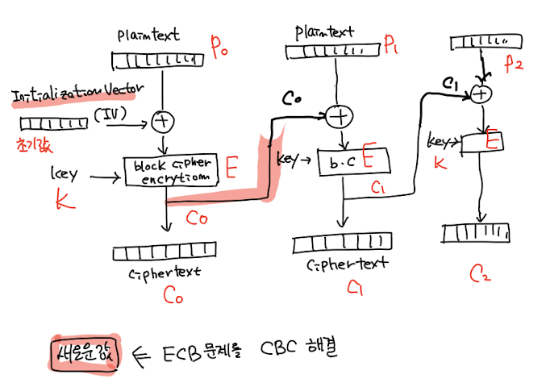
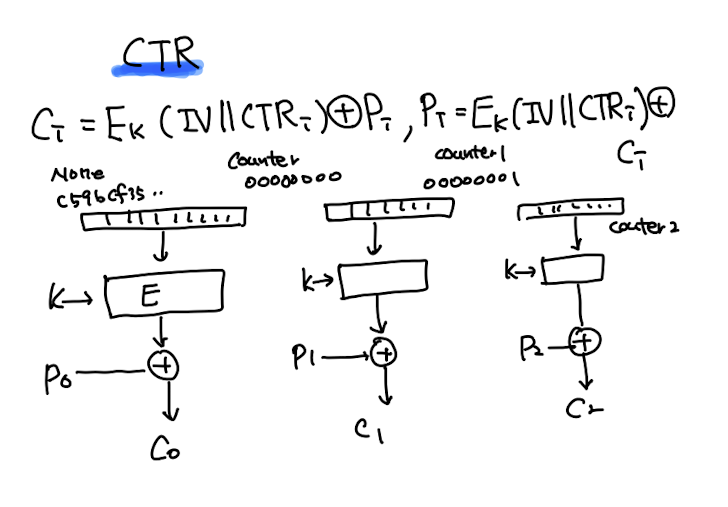

# 공개키 암호화

## 대칭 키 암호화

- 암호화와 복호화에 같은 키를 사용하는 암호화 방식

- 암호화 할 때는 1비트씩 하는데, 크게 스트림 방식과 블록 방식이 있다.

  - 스트림 암호화: 평문 그대로를 1비트씩 암호화
  - 블록 암호화: 평문을 블록 단위로 나누어 암호화

- 블록 암호와 유형

| -              | Feistel                                                              | SPN                                                               |
| -------------- | -------------------------------------------------------------------- | ----------------------------------------------------------------- |
| 개념           | 평문의 좌우를 나눠 키와 조합한 뒤 XOR 연산을 거쳐 좌우를 뒤집는 구조 | 샤논의 혼돈, 확산 이론 기반으로 S-box, P-box를 사용해 암호화      |
| 연산           | 반복연산에 따라 SPN 연산 범위의 2배 필요                             | 상대적으로 적은 연산 비용                                         |
| 구현           | 쉬움                                                                 | 어려움                                                            |
| 병렬 가능 여부 | 좌우로 뒤집힌 연산이므로 병렬 불가                                   | 가능                                                              |
| 복호화         | 암호화의 역산이 복호화                                               | 복호화 모듈이 별도로 필요함. 암호화 과정에서도 역함수가 필요하다. |
| 알고리즘       | DES, SEED                                                            | AES, ARIA                                                         |

## 블록 암호 운영모드

- 블록 알고리즘은 고정 길이의 블록을 암호화한다. 긴 평문을 암호화하기 위해서는 블록 암호 알고리즘을 반복적으로 사용하게 된다.
- 아래는 여러 블록들을 **동일한 key** 로 암호화할 때 사용하는 운영모드이다.

  - ECB
  - CBC
  - CFB
  - OFB
  - CTR

### ECB(Electronic Code Book)

- 평문들이 고정된 암호문 블록으로 암호화된다. => deterministic
- 장점:

  - 블록 간에 동기화가 불필요하다. 다른 블록과 관계없이 하나의 블록만을 암호화, 복호화하기 때문.
  - 한 블록에 오류가 발생해도 다른 블록에 영향을 주지 않는다.
  - 암호화, 복호화를 병렬 처리할 수 있다.

- 단점:
  - 평문이 같은 블록이라면 암호문도 같다. => 암호문 패턴이 보인다.
  - 치환 공격(공격자가 암호문 블록 순서를 재배열하는 공격)에 취약하다.

### CBC(Cipher Block Chaining)

- 특징

  - CBC 모드는 확률적(probabilistic) 암호화 방식이다. => IV가 다르면, 평문이 동일해도 생성되는 암호문이 다르다.
  - IV는 랜덤하게 생성되어야 한다.
  - IV는 비밀값이 아니어야 한다.

### CTR(Counter)

- 장점

  - 암호화, 복호화를 병렬 처리할 수 있다.
  - 최근에는 CBC보다 더 많이 사용된다.

---

## 공개 키 암호화

- 공개 키 암호화에서 암호화 키와 복호화 키는 다르다.
- 공개 키 암호화는 두 개의 키를 사용한다.

  - 공개 키: 누구나 알 수 있는 키
  - 개인 키: 자신만 알 수 있는 키

- 송신자는 자신의 개인 키로 암호화를 하고, 수신자는 송신자의 공개 키로 복호화를 한다.

- 기능

  - 기밀성: 개인 키로 암호화된 암호문은 공개 키로만 복호화할 수 있다.
  - 부인 방지: 개인 키로 암호화된 암호문은 공개 키로만 복호화할 수 있으므로, 송신자가 암호문을 생성했다는 것을 증명할 수 있다.

### 대칭 키 사용의 한계

- 대칭키 전달 문제: 상대에게 키를 안전하게 전달하기 어렵다.
- 사람이 n명이면, 각 사용자는 총 n-1개의 키를 필요로 한다. 총 키의 수는 n(n-1)/2개가 된다.
- 송신자, 수신자가 서로를 속일 수 있다.

### 비대칭 키 암호화 알고리즘

- 각 사용자는 공개 키, 개인 키를 생성한다.
- 과정

  - 암호화: 송신자는 암호화 시 수신자의 공개 키를 사용한다.
  - 복호화: 수신자는 복호화 시 자신의 개인 키를 사용한다.

- 전자 서명

  - 암호화: 송신자는 암호화 시 자신의 개인 키를 사용한다.
  - 복호화: 수신자는 복호화 시 송신자의 공개 키를 사용한다.(송신자의 공개 키로 복호화가 가능하다는 것은 송신자가 암호화를 했다는 것을 증명할 수 있다는 것을 의미한다.)

- 공개 키 만드는 방법(one way functions):

  - RSA - 소인수분해
  - Diffie-Hellman - 이산 로그
  - 타원 곡선 암호화 - 타원 곡선 이산 로그

### RSA

- 소인수분해의 어려움을 기반으로 한다.

  - 매우 큰 N으로부터 $N = p \times q$ 인 서로소인 p, q를 찾는 것이 어렵다.
  - public key: (N, e)
  - private key: (N, d)
  - 암호화: $C = M^e \mod N$
  - 복호화: $M = C^d \mod N$

- key 생성 과정

  - (1) 매우 큰 서로소인 두 수 p, q를 선택한다.
  - (2) N = pq를 계산한다.
  - (3) $\phi(N) = (p-1)(q-1)$를 계산한다.
  - (4) 1 < e < $\phi(N)$ 이고, $gcd(e, \phi(N)) = 1$ 인 e를 선택한다.
  - (5) private key인 d를 $ed \equiv 1 \mod \phi(N)$을 만족하는 d로 선택한다.
  - (6) 공개 키인 (N, e)와 개인 키인 (d)를 반환한다.

### PKI(Public Key Infrastructure)

- 인증서(certificate): 사용자명과 사용자의 공개 키
- 인증기관(CA): 사용자의 인증서 발행

  - CA는 인증서에 자신의 개인키로 서명해 자신이 인증한 것임을 증명한다.

- PKI의 책임

  - CA들의 구성 및 안전한 공캐키를 위해 아래 내용 명시
    - 인증기관(들)의 역할, 정책
    - 키 생성, 관리, 분배, 저장, 폐기 등 관련된 절차
  - 공개키를 안전하게 사용하기 위해 필요한 정보 규정

### 전자서명

- 송신자가 자신의 개인 키로 암호화를 하면, 수신자는 송신자의 공개 키로 복호화할 수 있다.

  - 무결성(메시지 변조 x)
  - 인증(송신자의 신분 증명)
  - 부인 봉쇄(송신자가 부인할 수 없음)

### 해시 함수

- 무결성, 인증을 위해 사용된다.
- 목적:

  - MAC(메시지 인증 코드)
  - 전자 서명
  - 키 생성
  - 난수 생성

- 해시 함수는 암/복호화를 위한 것이 아니다.

- 일반적인 해시 함수

  - 입력값보다 더 작은 길이의 출력값 생성
  - 출력값은 입력값이 갖는 특징을 그대로 가진다.

- 암호학적 해시 함수의 성질

  - 입력 메시지는 임의의 길이를 가질 수 있다.
  - 출력값은 고정된 길이이다.
  - 임의의 x에서 $h(x)$를 계산하는 것은 쉽다.
  - 단방향성: 임의의 y에 대해, $h(x) = y$를 만족하는 x를 찾는 것이 불가능해야 한다.
  - 약한 충돌방지: 임의의 x, $h(x)$ 가 주어졌을 때, $h(y) = h(x)$를 만족하는 y를 찾는 것이 불가능해야 한다.
  - 강한 충돌 방지: $h(y) = h(x)$를 만족하는 서로 다른 x, y를 찾는 것이 불가능해야 한다.
  - 눈사태 효과: 입력값의 작은 변화가 출력값에 큰 변화를 일으킨다.
