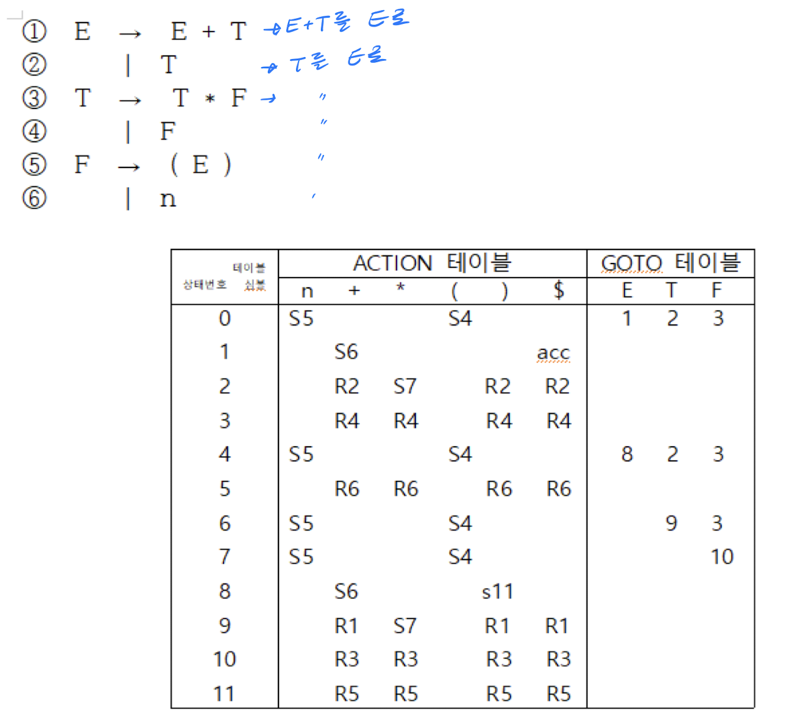
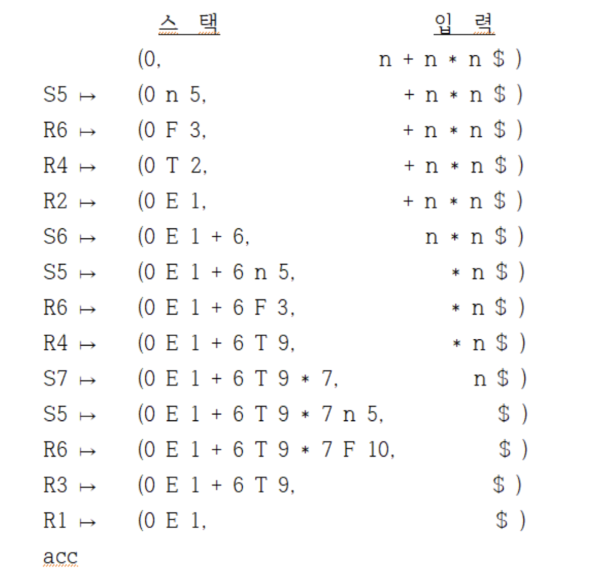
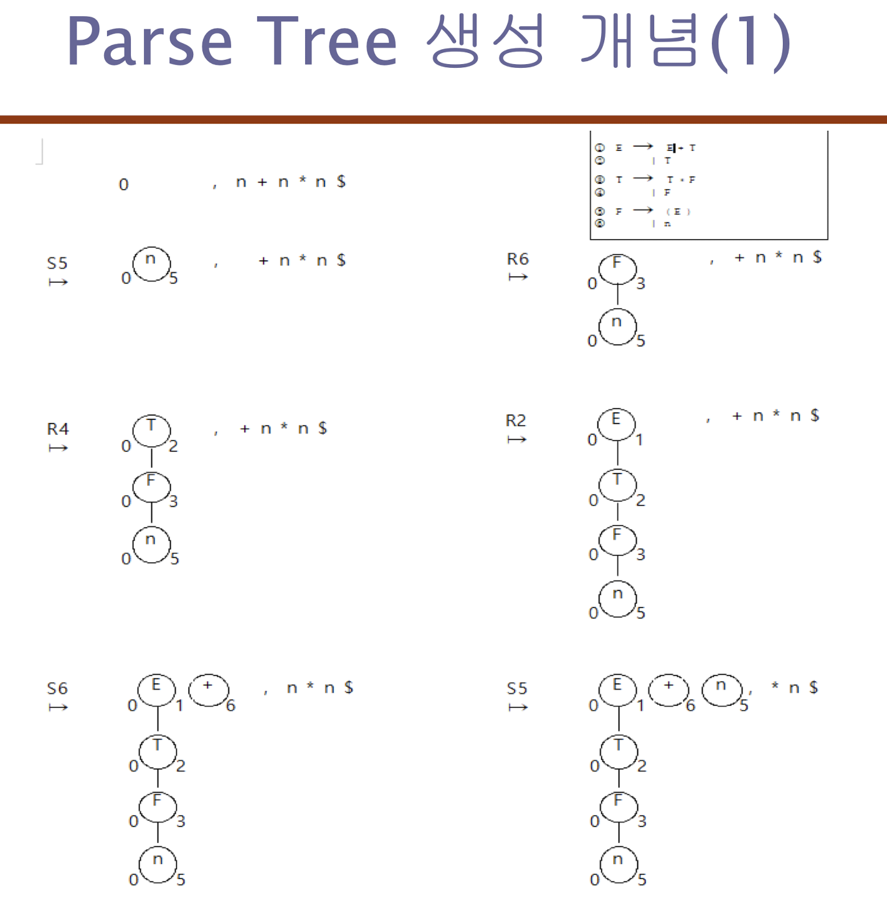
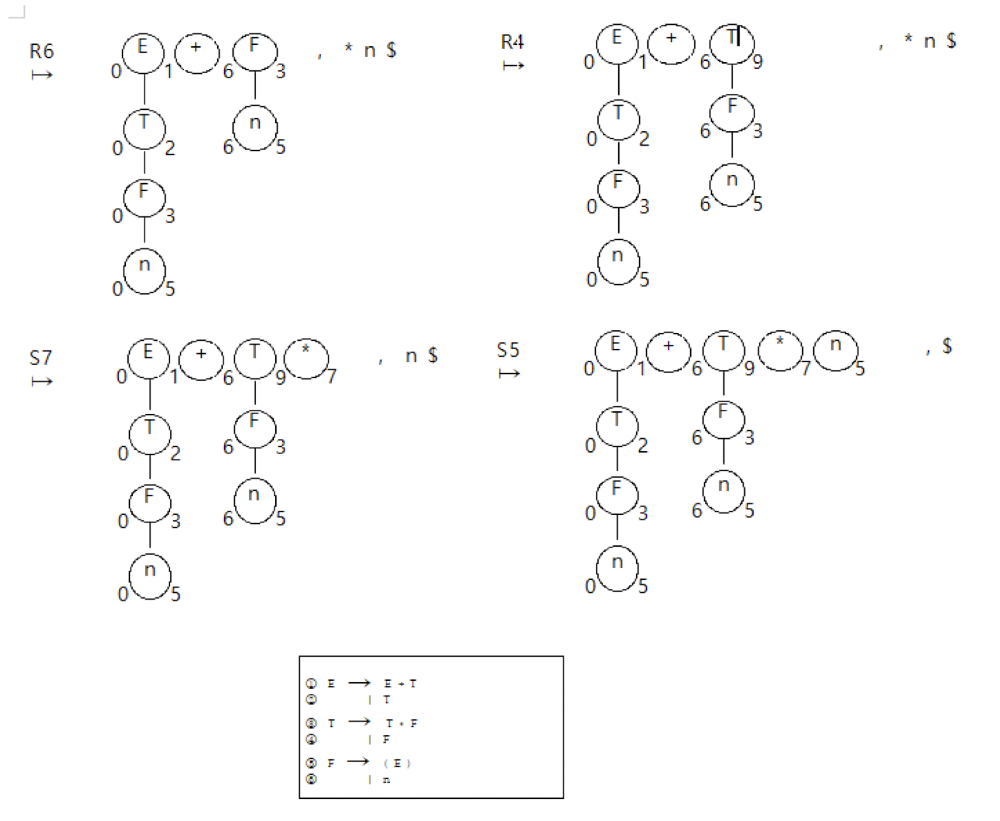
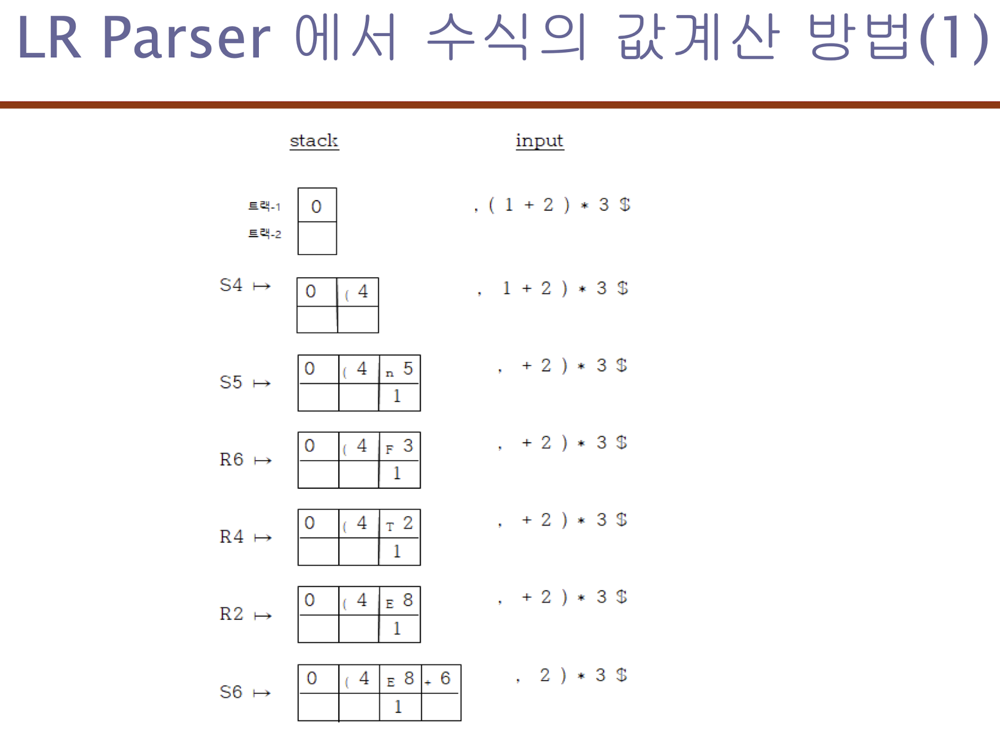
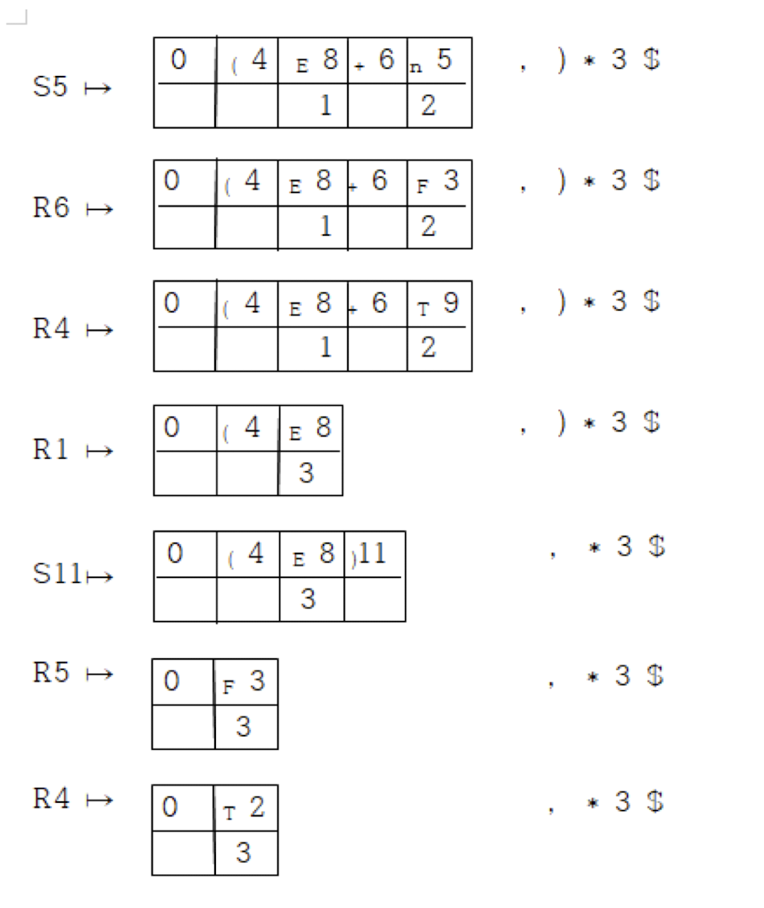
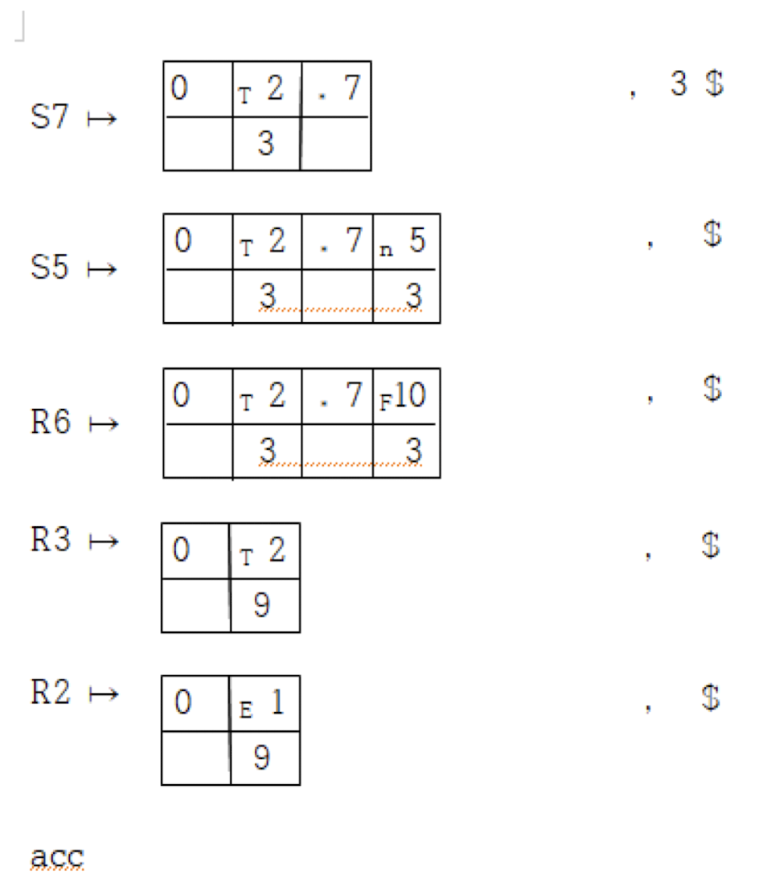

# 1

- 문법: 선언문들의 연속, 즉 변수(일반 선언문)와 함수 선언문의 연속이다.

- Recursive-descent parser의 작동

  - 시작 기호로부터 하향식으로 호출

    - `main() -> expression() -> term() -> factor() -> expression() ... `

  - 좌측 먼저 처리한다.
  - 한 개의 토큰씩만 필요하다.

- LR Parser

  
  
  
  
  
  
  
  
  
  
