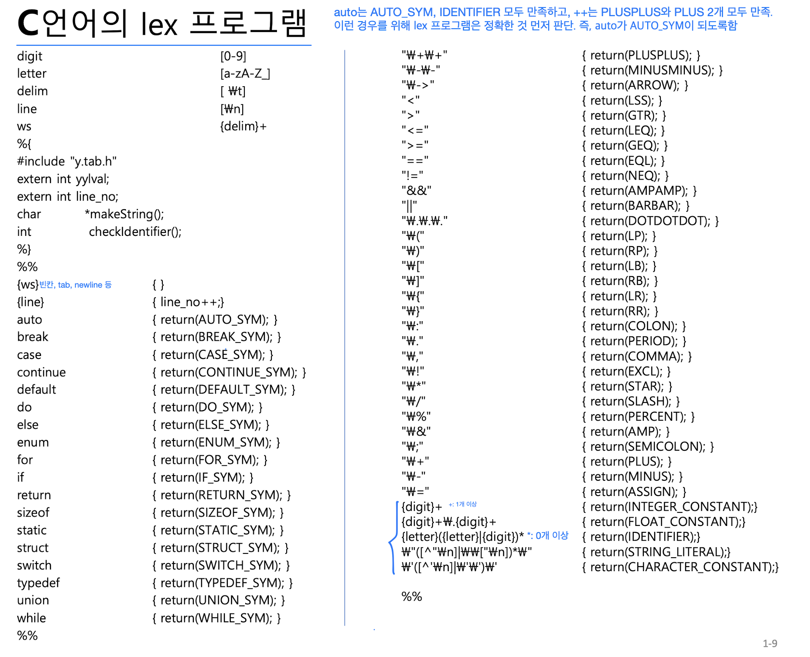

# 3 - Lexical Analyzer(어휘 분석기)

## 어휘 분석기의 역할

- `소스 코드` -> `symbol table을 참조해 lexical analysis 수행(yylex())` -> `token 생성` -> `parser에서 syntax analysis 수행(yyparse())` -> `syntax tree`

## Lex

- Lex 명세서를 lex에 입력으로 주면 `lex.yy.c`라는 C 코드를 생성해준다.

- `y.tab.h`: `#define PLUS 2` 등의 정의가 선언되어 있는 헤더 파일
