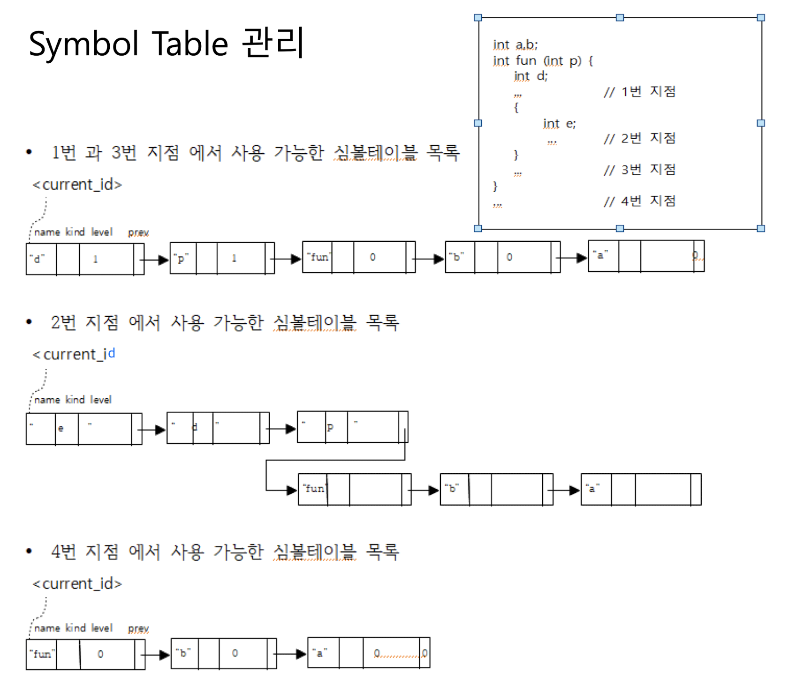
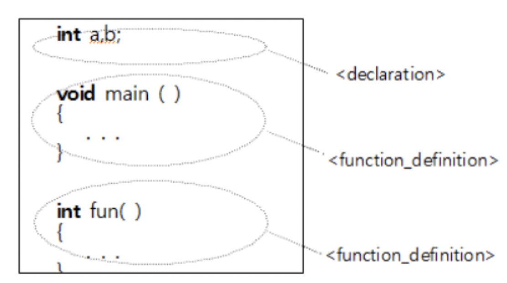
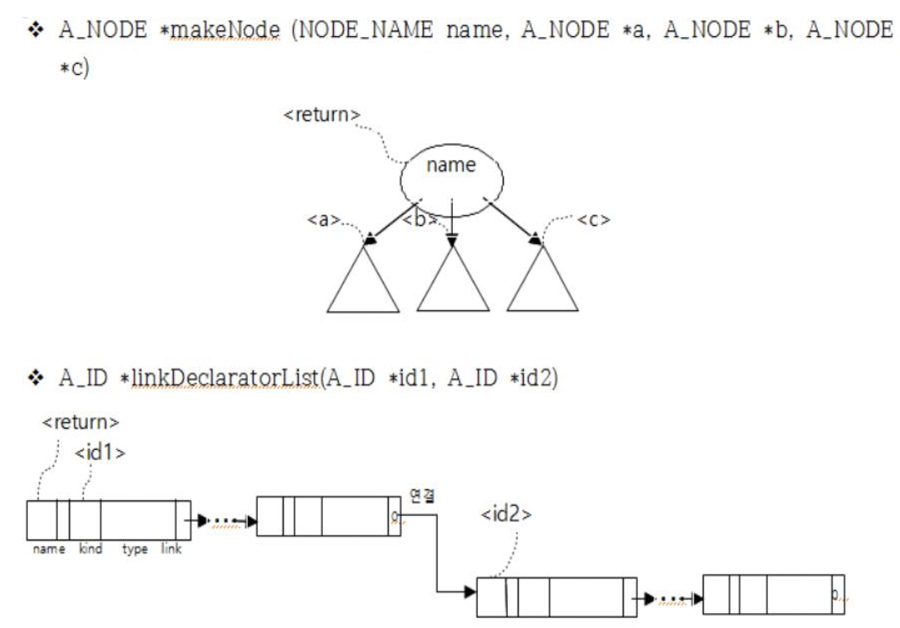
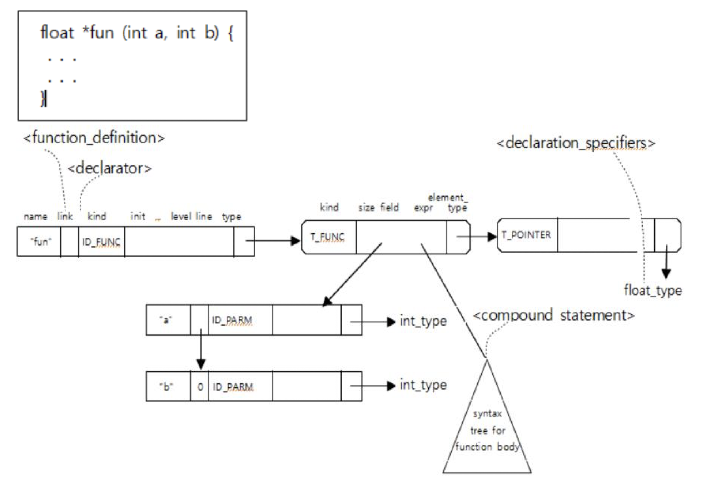
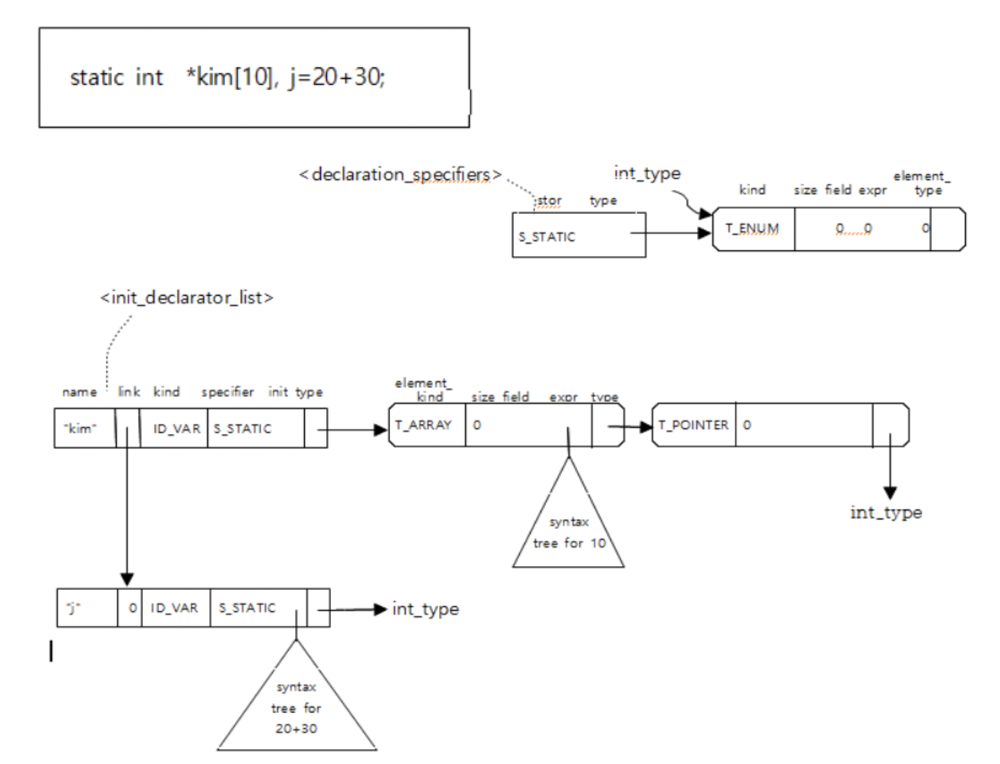
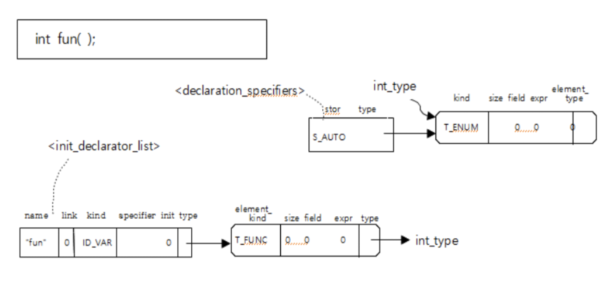
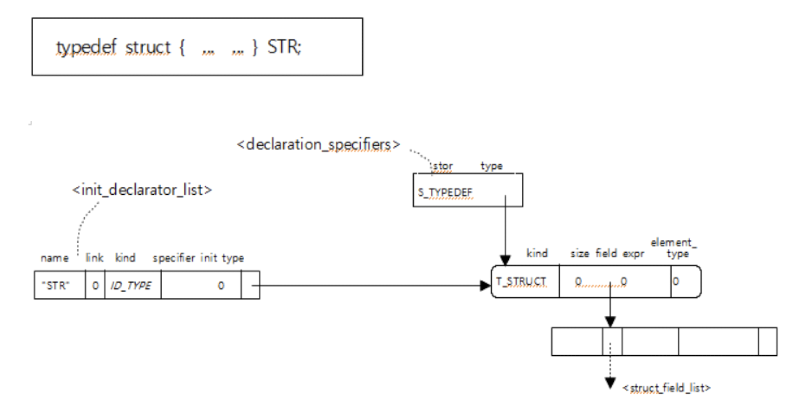

# 5 - Syntax analyzer

- 소스코드는 lexical analysis(`yylex()`)를 먼저 거치고, 그 다음 syntax analysis(`yyparse()`)를 거쳐 syntax tree로 변환된다.

- 아래의 기초 수준의 문법 검사를 해보자.

  - 모든 명칭 저장 후 중복 선언 검사
  - 명칭의 속성, 종류, 리턴 타입 계산
  - 함수 선언문의 형태, 리턴 타입, 파라미터 검사
  - 전방 참조 검사
  - 명칭의 사용 방법 검사

## 스코프 규칙

- 블록 스코프
- 파라미터 스코프
- 프로토타입 스코프
- 함수 스코프
- 파일 스코프

## 스코프 규칙 처리 프로그램

- `makeIdentifier()`: 새롭게 선언되는 모든 명칭을 symbol table 목록에 저장하고 차례대로 연결
  - 전역 변수인 `current_id`를 사용해 선혁 탐색할 수 있도록 순서대로 연결한다.
  - symbol table의 `<prev>`를 사용해 연결한다.
  - 최근 선언한 명칭부터 탐색되도록 거꾸로 연결한다.



## symbol table 및 type table의 초기화

- `ID_TYPE`: int, float, char 등
- `ID_FUNC`: printf, scanf 등
- int_type, float_type, char_type, string_type 등

## Level 값의 관리

- `current_level`은 처음에 0으로 초기화된다.
- 그리고 `current_level`이 변경되는 시점은 아래와 같다.

  - `struct { }`, `compount statement의 { }`에서 `{` 가 나올 때 +1
  - `}`가 나올 때 -1
    - 단, `enum { }`에서는 `{`, `}`에 따라 level이 변경되지 않는다.
  - 함수 파라미터 목록에서 `(`가 나오면 +1, `)`가 나오면 -1

## Symbol table 관리

- 새로운 명칭의 선언과 symbol table에 명칭을 추가하는 시점은 아래와 같다.

  - 선언문(일반 선언문, 구조체 필드 선언문, 파라미터 선언문)에서 명칭을 갖는 선언자(declarator)가 나올 때
  - 함수 선언문에서 명칭을 갖는 선언자(declarator)가 나올 때
  - 구조체나 나열형 타입의 태그 명칭이 나올 때
  - 나열형 타입 선언 중에서 명칭 상수가 나올 때

```c
A_ID *makeIdentifier(char *s) {
	A_ID *id;
	id = malloc(sizeof(A_ID));
	id->name = s;
	id->level = current_level;
	id_prev = current_id;
	current_id = id; // 새로운 명칭 저장
	//...
	return id;
}
```

## 불완전(incomplete) 선언과 전방 참조(forward reference)

- 전방 참조의 경우:

  - 함수 명칭: 뒤에 나와도 되고, 아예 안나오더라도 선언한 것처럼 취급
  - goto문의 label 명칭: 함수 내
  - 구조체, 나열형의 태그 명칭: 해당 함수 내

- 전방 참조 명칭을 검사하는 시기:

  - 전체 프로그램의 끝 부분
  - 구조체의 필드 선언문 목록의 끝 부분 = `struct { } `의 `}`가 나올 때
  - 함수의 파라미터 선언문 목록 끝 부분
  - 복합문의 끝 부분 = compound statement의 맨 끝

## Program 분석




- 위 그림에서 root는 `makeNode(N_PROGRAM, 0, $1, 0)`으로 생성된다.



## 함수 선언문(function definition) 분석



```c
A_ID *setFunctionDeclaratorSpecifier(A_ID *id, A_SPECIFIER *p) {
	// 중복 선언 검사
	// searchIdentifierAtCurrentLevel(id -> name, id -> prev); 로 검사 가능
	// 함수의 리턴 타입 구성 및 결정
	// 함수 선언을 위한 명칭인지 검사
	// 프로토타입 선언이 미리 있는 경우, 파라미터 검사
	// 파라미터 스코프 조정
}

A_ID *setFunctionDeclaratorBody(A_ID *id, A_NODE *node) {
	// 함수의 body(expr)를 주어진 syntax tree에 연결
}

A_SPECIFIER *makeSpecifier(A_TYPE *t, S_KIND S) {
	// A_SPECIFIER 테이블 생성
}
```

## 일반 선언문(declaration) 분석

```c
A_ID *setDeclaratorListSpecifier(A_ID *id, A_SPECIFIER *p) {
	// 명칭 목록들에 대해
	// 명칭의 중복 선언 검사
	// 명칭의 타입 구성
	// 명칭의 종류 구별(타입 정의 명칭, 함수 명칭, 변수 명칭)
}
```




