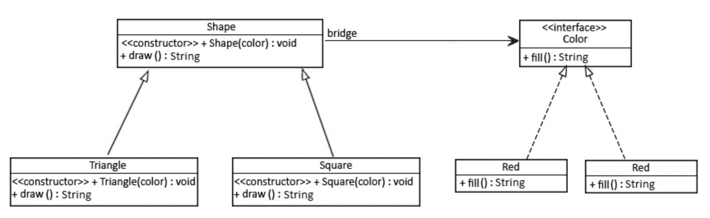

# Bridge Pattern

<h2>개요</h2>

- Bridge Design Pattern은 GoF가 소개한 패턴으로, 추상화된 부분을 구현체로부터 분리하여  
  이들이 각자 변경될 수 있도록 해주는 패턴이다.

- 이 패턴은 객체지향적 프로그래밍 방식을 따르는 경우, 다른 추상화 클래스들 사이에 연결고리(Bridge)를  
  만들라는 것을 의미한다.

<h2>예시</h2>

- Bridge Pattern을 사용해보기 위해 2 단계로 추상화된 클래스가 있다고 해보자.



- 우선 `Color` 인터페이스를 보자.

```java
public interface Color {
    String fill();
}
```

- 이제 위 인터페이스의 구현체를 보자.

```java
public class Blue implements Color {
    @Override
    public String fill() {
	return "Blue";
    }
}
```

- 다음으로 `Color`와의 참조(bridge) 관계를 만들어주는 `Shape` 추상 클래스를 보자.

```java
public abstract class Shape {
    protected Color color;

    // 생성자

    abstract public String draw();
}
```

- 마지막으로 `Shape`의 구현 클래스를 만들어보자.

```java
public class Square extends Shape {
    public Square(Color color) {
	super(color);
    }

    @Override
    public String draw() {
	return "Square is drawn" + color.fill();
    }
}
```

- 이제 아래의 테스트는 정상적으로 수행될 것이다.

```java
@Test
public void bridgePatternSuccess() {
    // A square with blue color
    Shape square = new Square(new Blue());

    assertEquals("Square is drawn Blue", square.draw());
}
```

<h2>결론</h2>

- 위 예시 코드에서 Bridge는 `Shape`에 해당하는데, 추상화된 `Color`를 참조하면서  
  `Color`의 `fill()`을 `Color`의 구현체들이 구현하도록 책임을 위임하고 있다.

- Bridge Pattern은 아래의 경우들에 대해 유용하게 사용할 수 있다.

  - 부모 클래스(추상)가 기본적인 규칙을 정의하고, 자식 클래스(구현체)가 추가적인 규칙을 정의하는 경우
  - 다른 객체에 대해 참조 관계를 가지는 추상 클래스가 있고, 이 추상 클래스에 구현 클래스가 정의해야하는 추상 메소드가 있는 경우

<hr/>

- 참고 문서: <a href="https://www.baeldung.com/java-bridge-pattern">링크</a>
