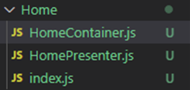

<h1>Container Presenter Pattern</h1>

* 이 패턴은 React Application에 사용되는 패턴이다.

* 기본적으로 `Container`는 data, state를 가지며 API 호출을 하며,   
  각각에 알맞은 로직을 처리한다.

* `Presenter`는 `Container`의 데이터들을 보여주는 역할을 담당한다.   
  `Presenter`는 state를 가지지 않으며, API에 대해 모르며, 클래스도 없는   
  함수형 컴포넌트이다.

* 즉 `Container`는 데이터이며, `Presenter`는 스타일이다.

* 구조 예시

