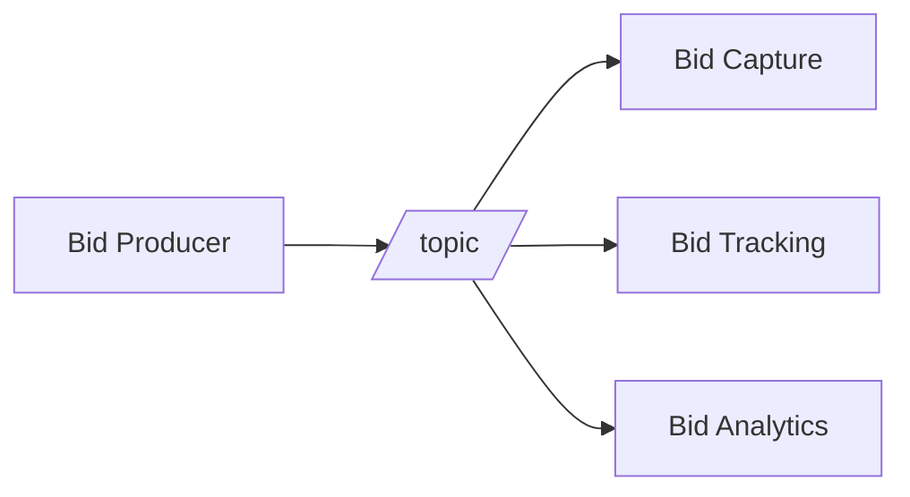
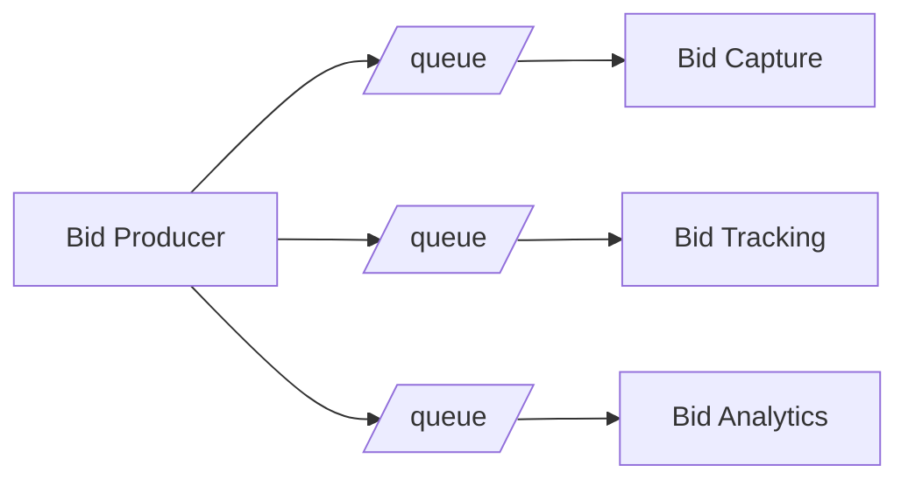

# 2. 아키텍쳐 사고

- 아키텍쳐 사고(architectural thinking)는 단순히 '아키텍쳐를 생각하는 것' 이 아니라, 아키텍쳐적인 눈으로, 즉 아키텍쳐의  
  관점에서 사물을 바라보는 것을 의미한다. 이 사고방식은 크게 네 가지로 나뉜다.

  - 1. 아키텍쳐와 설계의 차이를 이해하고, 아키텍쳐 작업을 진행하려면 개발팀과 어떻게 협력해야 할지 아는 것.
  - 2. 어느 정도 기술 깊이를 유지하면서 폭넓은 기술 지식을 확보하는 것.
  - 3. 다양한 솔루션과 기술 간의 tradeoff를 이해하고, 분석하고, 조율하는 것.
  - 4. 비즈니스 driver의 중요성을 이해하고, 그것을 아키텍쳐 관심사로 해석할 줄 아는 것.

## 2.1 아키텍쳐 vs 설계

- 전통적인 아키텍트와 개발자의 책임을 비교해보면, 아키텍트와 개발자를 나누는 가상의 물리적 장벽이 존재하고, 항상 아키텍트에서  
  개발자로의 단방향 화살표만이 이 장벽을 통과한다. 이것이 아키텍쳐와 연관된 모든 문제의 원인이 되는데, 아키텍트가 내린 결정이 개발팀에서  
  전혀 쓸모가 없는 경우가 있음에도 불구하고, 개발팀이 아키텍쳐를 변경하기로 한 내용이 다시 아키텍트에게 전달되는 일은 거의 없다.  
  즉 아키텍트가 개발팀과 완전히 단절되어 있기에 원래 의도했던 아키텍쳐와 점점 멀어지게 되는 것이다.

- 제대로된 아키텍쳐를 만드려면 아키텍트와 개발자를 가르는 가상의 물리적 장벽이 허물어져야 하고, 이 둘은 가상의 동일한 팀에 소속되어 있어야 한다.

- 아키텍쳐, 설계 모두 소프트웨어 프로젝트 생명 주기의 일부로서 항상 서로 동기화되어야 성공할 수 있다.

---

## 2.2 기술 폭(technical breadth)

- 업무를 진행하기 위해 기술 깊이를 확보해야 하는 개발자와 달리, 소프트웨어 아키텍트는 아키텍트 답게 사고하고, 아키텍쳐 시각을 유지하기 위해  
  상당한 기술 폭을 갖춰야 한다.

---

## 2.3 Tradeoff 분석

- 아키텍쳐는 구글링해도 안되는 것이다.
- 아키텍쳐에는 정답도, 오답도 없다. 오직 트레이드오프만 있을 뿐.

- 경매 참가자들이 원하는 물품에 입찰하는 경매 시스템을 예시로 보자.  
  `Bid Producer`는 입찰자로부터 입찰을 생성하고, 입찰 금액을 `Bid Capture`, `Bid Tracking`, `Bid Analytics` 서비스에  
  전달한다. 이 작업은 queue를 이용한 점대점 메시징 방식도 가능하고, topic을 이용한 메시지 발생/구독으로도 구현 가능하다.  
  이 둘중 어떤 것을 사용해야 할까? 정답은 없다. 아키텍쳐적으로 사고하려면 각 방안의 tradeoff를 분석하고 주어진 상황에서 가장 나은 선택을 해야한다.

- 아래는 topic을 이용한 방식의 다이어그램이다.

- 아래는 queue를 이용한 점대점 메시징 방식의 다이어그램이다.

- topic 방식은 아키텍쳐 확장성이 확실한 강점이다. queue를 이용하면 `Bid Producer` 서비스가 3개의 queue에 접속해야 하지만,  
  topic 방식으로는 하나의 topic만 연결하면 된다. 나중에 새로운 서비스를 생성하더라도, 기존 시스템은 전혀 고칠 필요가 없다.  
  하지만 queue를 사용하면 새로운 서비스를 위한 queue가 필요해지고, `Bid Producer`가 이 queue에 추가 접속해야 하므로  
  어떤 식으로든 변경은 불가피하다. 요약하자면 새로운 서비스가 추가될 때 topic 방식은 기존 인프라를 전혀 손댈 필요가 없지만, queue  
  방식은 적잖은 변경 작업이 수행되어야 한다는 점이다.

- 여기까지 보니, topic 방식이 최적의 선택으로 보일 것이다. 하지만 아키텍쳐 사고는 장점 뿐만 아니라 단점, tradeoff도 분석해야 한다.  
  단점을 분석해보자. topic을 보면 누구나 데이터에 접근(구독)이 가능한 구조이기에 데이터 보안 문제가 불거질 수 있지만, queue는  
  데이터를 수신하는 지정된 consumer에서만 데이터 접근이 가능하다.

- 또한, topic 솔루션은 하나의 contract만 지원하므로 입찰 데이터를 수신하는 서비스들은 모두 동일한 contract 및 입찰 데이터 세트를  
  받아야 한다. 하지만 queue 솔루션은 각 consumer가 원하는 데이터에 대한 자신만의 contract를 가질 수 있다.

- 마지막으로 topic 방식은 topic 메시지를 모니터링할 수도 없고, auto-scaling 기능이 지원되지 않는다. 반면 queue 방식은 각  
  queue를 따로 모니터링할 수 있고, 각 consumer마다 개별적으로 load balancing 로직을 적용할 수 있기에 상호 독립적인  
  자동 확장이 가능해진다.

- 이렇게까지 봤을 때에도 topic 방식이 더 낫다고 할 수 있을까? 그렇다고 queue 방식이 더 낫다고 할 수도 없다.  
  이렇게 여러 솔루션들을 비교해서 tradeoff를 분석할 수 있어야 하고, 선택하는 과정에는 언제나 비즈니스 동인(driver), 환경 등  
  다양한 요소들이 작용한다.

---
