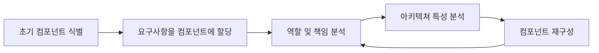

# 8. 컴포넌트 기반 사고

- 모듈은 연관된 코드의 묶음을 의미할 때가 많지만, 아키텍트는 보통 모듈을 물리적으로 구현한 컴포넌트로 생각한다.
- 개발자는 자신의 개발 플랫폼에 따라 여러 가지 방법으로 모듈을 물리적으로 패키징한다. 이렇게 모듈을 물리적으로 패키징한 것을  
  컴포넌트라고 하며, Java의 jar, Ruby의 gem 등 대부분의 언어는 패키징을 지원한다.

- 이번 장에서는 범위부터 검색에 이르기까지 컴포넌트에 대한 아키텍쳐 고려사항을 알아보자.

---

## 8.1 컴포넌트 범위

- 컴포넌트는 아티팩트를 한데 묶어 필요 시 중첩시켜 계층화하는, 언어에 특정한 메커니즘을 제공한다.  
  가장 단순한 컴포넌트는 클래스보다 한 단계 높은 수준의 모듈로 코드를 래핑한 것으로, 이를 보통 라이브러리라고 한다.  
  라이브러리는 대개 호출부 코드와 동일한 메모리 주소에서 실행되며, 해당 언어의 함수 호출 메커니즘을 이용해 통신한다.  
  그리고 컴파일 타임에 의존한다.

- 컴포넌트는 아키텍쳐에서 서브시스템이나 레이어 형태로도 나타나며, 많은 이벤트 프로세서를 위한 배포 가능한 작업 단위이다.  
  서비스는 또다른 종류의 컴포넌트로 자신의 주소 공간에서 실행되며, TCP/IP 같은 저수준 네트워크 프로토콜이나 REST, message queue  
  등의 고수준 포맷을 통해 통신한다. MSA에서 서비스는 배포 가능한 독립적인 단위를 형성한다.

- 아키텍트 입장에서 컴포넌트는 언어가 제공하는 저수준이 아닌, 더 높은 수준에서 모듈성을 가지는 것이 유용할 때가 많다.  
  예를 들어 MSA 에서 단순성은 아키텍쳐 원칙 중 하나이므로, 서비스는 컴포넌트가 될 정도의 충분한 코드로 구성하거나, 적은 양의  
  코드만 담도록 단순하게 설계하는 것이 좋다.

---

## 8.2 아키텍트 역할

- 아키텍트는 아키텍쳐 내부의 컴포넌트를 정의, 개선, 관리, 통제한다.

### 8.2.1 아키텍쳐 분할

- 소프트웨어는 만사가 다 tradeoff인데, 주어진 아키텍쳐에서 컴포넌트를 만드는 것도 마찬가지이다.  
  컴포넌트는 일반적인 적재 메커니즘을 의미하므로 아키텍트는 재량껏 어떤 유형의 분할도 할 수 있다.  
  아키텍쳐 스타일은 이후에 자세히 다룰 예정이니, 여기서는 최상위 분할(top-level partitioning)이라는 중요한 스타일만 보자.

- Layered 아키텍쳐와 모듈러 모놀리스(modular monolith)를 보자. Layered는 익숙한 반면, 모듈러 모놀리스는 기술적인 능력이 아닌,  
  도메인에 따라 분할된 단일 배포 단위를 의미한다. (둘 다 DB를 하나 사용한다) 이 두 가지 스타일은 서로 다른 방법으로 아키텍쳐를  
  최상위 분할한 결과이다. 각 최상위 컴포넌트의 내부에는 다른 컴포넌트들이 내장되어 있다.

- 기술적 최상위 분할은 layered 아키텍쳐와 같이 기술적인 능력에 따라 아키텍쳐를 구성하는 것을 의미한다.  
  아키텍트는 시스템 기능을 기술적인 능력, 즉 presentation, business, service, persistence 등으로 분할한다.  
  이렇게 코드를 구성하면 여러 면에서 합리적인데, 먼저 persistence 코드가 어느 한 layer에 있으면 개발자가 persistence 관련  
  코드를 쉽게 찾을 수 있다.

- 반면 모듈러 모놀리스 아키텍쳐는 도메인 분할을 나타낸 것이다. 모듈러 모놀리스는 복잡한 소프트웨어 시스템을 분리하는 모델링 기법을  
  다룬 DDD에서 비롯되었다. DDD에서 아키텍트는 서로 독립적으로 분리된 도메인 혹은 workflow를 식별하는데, 이는 MSA의 근본  
  사상이기도 하다. 모듈러 모놀리스를 설계하는 아키텍트는 기술적 능력 대신, 도메인이나 workflow에 따라 아키텍쳐를 분할한다.  
  도메인 분할 아키텍쳐에서 컴포넌트는 서로 중첩될 때가 많기에 각 컴포넌트는 persistence 라이브러리를 사용하거나, 별도의 layer에  
  비즈니스 규칙을 둘 수 있지만, 어쨌든 최상위 분할은 도메인을 중심으로 전개된다.

- 기술적 분할을 택한 아키텍트는 시스템 컴포넌트를 presentation, business, persistence 등의 기술적 능력에 따라 구성한다.  
  이 아키텍쳐의 구성 원칙 중 하나는 '기술 관심사의 분리'로서, 이는 결국 유용한 수준의 디커플링을 만든다. Layer를 분할함으로서  
  의존하는 컴포넌트에 줄줄이 부수 효과가 전파되지 않도록 막을 수 있다.

- 기술적으로 분할하면 코드베이스가 기능별로 구성되므로 개발자가 코드베이스의 특정 카테고리를 쉽게 찾을 수 있지만, 현실적으로 대부분의  
  소프트웨어 시스템은 여러 기술, 기능들을 넘나드는 workflow를 필요로 한다.

- 이 둘을 간단히 비교해보자.

- 도메인 분할: 최상위 컴포넌트를 workflow 혹은 도메인에 따라 나눈다.

  - 장점:
    - 세부 구현보다 비즈니스 기능에 더 가깝게 모데링된다.
    - 도메인별 다목적팀을 구성하기 쉽다.
    - 모듈러 모놀리스와 MSA 스타일에 더 가깝게 맞출 수 있다.
    - 메시지의 흐름이 문제 영역과 일치한다.
    - 데이터와 컴포넌트를 분산 아키텍쳐로 옮기기 쉽다.
  - 단점:
    - 유저 정의 코드가 여기저기 널려있다.

- 기술 분할: 최상위 컴포넌트를 기술적인 능력에 따라 분리한다.
  - 장점:
    - 커스텀 코드가 명확히 분리된다.
    - Layered 아키텍쳐 패턴에 더 가깝게 맞출 수 있다.
  - 단점:
    - Global coupling이 더 높다. 따라서 공통 혹은 로컬 컴포넌트 중 하나라도 변경되면 다른 모든 컴포넌트가 영향받을 가능성이 높다.
    - 개발자가 공통 layer, 로컬 layer 양쪽에 도메인 개념을 복제해야 할 수도 있다.
    - 일반적으로 데이터 레벨의 커플링이 높다.

---

## 8.3 컴포넌트 식별 흐름

- 컴포넌트 식별은 후보를 도출하고 피드백을 통해 다듬어가는 과정을 반복하는 것이 가장 좋다.

- 아키텍쳐는 이런 주기를 반복하면서 점점 구체화된다.

### 8.3.1 초기 컴포넌트 식별

- 가장 먼저 적용할 최상위 분할의 유형에 따라 최상위 컴포넌트를 어디서부터 시작할지 결정해야 한다.  
  그 밖에도 원하는 컴포넌트를 자유롭게 구성하면서, 어느 기능을 어디에 둘지 도메인 기능을 배핑한다.  
  초기 식별한 컴포넌트들만으로 제대로된 설계가 나올 가능성은 거의 없으니, 아키텍트는 컴포넌트 설계를 이터레이션하면서 조금씩 개선해야 한다.

### 8.3.2 요구사항을 컴포넌트에 할당

- 초기 컴포넌트를 식별한 후, 컴포넌트에 요구사항을 대입해서 잘 맞는지 확인한다. 이 과정에서 새로운 컴포넌트를 만들거나, 기존 컴포넌트를  
  통합하거나, 하는 일이 너무 많은 컴포넌트는 분해할 수 있다. 매핑이 정확할 필요는 없다. 단지 앞으로 설계를 계속 보완할 수 있도록  
  큰 단위의 기반을 찾으려 노력하면 된다.

### 8.3.3 역할 및 책임 분석

- 컴포넌트에 요구사항을 대입할 때, 요구사항을 파악하는 단계에서 밝혀진 역할과 책임도 살펴보고, 세분도가 적합한지 확인한다.  
  애플리케이션이 지원해야 할 역할과 기능을 둘 다 고려해야 컴포넌트와 도메인의 세분도를 서로 맞출 수 있다.

### 8.3.4 아키텍쳐 특성 분석

- 컴포넌트에 요구사항을 대입할 때, 아키텍트는 앞서 식별한 아키텍쳐 특성들이 컴포넌트 분할 및 세분도에 어떤 영향을 미치는지 살펴본다.  
  순수하게 기능적인 관점에서만 컴포넌트를 설계하면 유저 상호작용을 처리하는 단일 컴포넌트가 도출되지만, 아키텍쳐 특성들을 분석하면  
  더 하위 컴포넌트로 잘게 나눌 수 있다.

### 8.3.5 컴포넌트 재구성

- 소프트웨어 설계에서 피드백은 항상 중요하고, 컴포넌트 설계를 반복하는 접근 방법은 매우 중요하다.  
  그 이유로 먼저 차후 재설계를 하게 만들 수 있는 모든 발견과 특이 사례를 전부 고려하기란 사실상 불가능하다.  
  둘째로, 아키텍쳐와 개발자가 애플리케이션 구축에 점점 더 깊이 빠질수록 서로의 기능과 역할을 어떻게 조정하면 좋을지  
  서로 다른 시각으로 바라보게 된다.

---

## 8.4 컴포넌트 세분도(granularity)

- 컴포넌트에 가장 적당한 세분도를 찾는 것은 정말 어려운 작업이다. 너무 잘게 나눠 설계하면 컴포넌트 간 통신이 너무 많아지고, 그렇다고 너무 크게  
  나누면 내부적으로 커플링이 증가해 배포, 테스트가 어려워지고 모듈성 관점에서도 부정적인 영향을 미친다.

## 8.5 컴포넌트 설계

- 컴포넌트 설계에 있어 silver bullet은 없다. 팀과 조직에서 사용하는 소프트웨어 개발 프로세스와 맞물려 다양한 기술과 tradeoff가  
  있겠지만, 아키텍트는 아키텍쳐를 설계하면서 요구사항을 접수하고 애플리케이션을 구성할 굵직한 구성요소를 그려봐야 한다.

### 8.5.1 컴포넌트 발견

- 아키텍트는 개발자, 비즈니스 분석가, 도메인 전문가와 협력해 시스템에 대한 일반적인 지식과 시스템을 어떻게 분할할지 결정하고,  
  그에 따라 초기 컴포넌트 설계를 진행한다. 초기 설계의 목표는 여러 아키텍쳐 특성을 고려해 문제 영역을 큼지막한 덩이들로 나누는 것이다.

#### 엔티티 함정

- 컴포넌트를 확정하는 문제에 답은 없지만, 엔티팀 함정 안티패턴은 자주 나오니 조심해야 한다.  
  일반적으로 프레임워크를 데이터베이스에 컴포넌트 관계형으로 매핑한 것에 불과한 것을 의미한다.

- 엔티티 함정은 아키텍트가 DB 관계를 애플리케이션의 workflow로 오해할 때 벌어진다.  
  이 안티패턴은 애플리케이션의 실제 workflow에 대한 지식이 얼마나 부족한지를 나타내며, 이 함정에 빠져 생성된 컴포넌트는  
  너무 큼지막하게 나뉘어지기에 코드의 전체적인 구조와 패키징 관점에서 개발팀에게 지침이 될만한 것이 하나도 없다.

#### 액터/액션 접근법(actor/actions approach)

- 이 방식은 아키텍트가 요구사항을 컴포넌트에 매핑할 때 즐겨 쓰는 방식이다.  
  이 접근법은 원래 RUP(Rational Unified Process)에 정의된 것으로, 아키텍트는 애플리케이션에서 뭔가 일을 하는 액터와  
  그들이 수행하는 액션을 식별하고, 시스템의 대표적인 유저와 이들이 시스템에서 어떤 종류의 일을 하는지 찾아낸다.

- 액터/액션 접근법은 특정 소프트웨어 개발 프로세스, 특히 선생 설계(upfront design)를 매우 선호하는 공식적인 프로세스와  
  맞물려 인기를 얻었다. 이 방법은 요구사항 측면에서 역할이 분명하고 그들이 수행하는 액션의 종류가 확실한 경우에 잘 작동하며,  
  아직도 많이 쓰인다. 이런 방식의 컴포넌트 분해는 모놀리식, 분산 시스템을 비롯한 모든 종류의 시스템에 통용된다.

#### Event Storming

- 이 방식은 DDD에서 사용되는 컴포넌트 발견 기법이며, 역시 DDD의 영향을 많이 받은 MSA와 더불어 널리 보급되었다.  
  이벤트 스토밍을 하는 프로젝트에서는 다양한 컴포넌트가 메시지나 이벤트를 통해 서로 통신한다고 가정한다.  
  따라서 팀은 요구사항과 식별된 역할에 따라 시스템에서 어떤 이벤트가 일어나는지 파악하고, 컴포넌트를 이벤트와 메시지 핸들러  
  중심으로 구축한다. 이 방법은 eventual consistency 시스템에서 사용할 메시지를 아키텍트가 정의하는 데 도움이 되므로  
  이벤트와 메시지를 사용하는 MSA와 같은 분산 아키텍쳐에서 주효하다.

#### Workflow 접근법

- 이 접근법은 이벤트 스토밍의 대안으로서, DDD나 messaging을 사용하지 않는 더 일반화한 방법이다.  
  이벤트 스토밍과 비슷하지만, 메시지 기반 시스템을 구축하는 데 있어 명시적인 제약 조건이 없다.  
  Workflow 접근법은 핵심 역할을 식별하고 이 역할이 관여하는 workflow 유형을 결정하며, 그렇게 식별된 활동에 따라 컴포넌트를 구축한다.

---

## 8.6 아키텍쳐 퀀텀 딜레마: 모놀리식 vs 분산 아키텍쳐

- 아키텍쳐 퀀텀으로 아키텍쳐 특성의 범위를 정의한다고 7장에서 보았다.  
  초기 컴포넌트 설계를 마친 아키텍트는 중요한 결정(모놀리식이냐 분산 아키텍쳐냐)를 내려야 한다.

- 모놀리식 아키텍쳐는 보통 배포 단위가 하나밖에 없으므로 단일 DB에 접속해 실행되는 모든 시스템 기능이 포함된다.  
  분산 아키텍쳐는 이와 정반대로, 자신의 체계를 갖추고 네트워킹 프로토콜을 통해 서로 통신하는 여러 서비스로 구성된다.  
  분산 아키텍쳐는 배포 단위가 잘게 나뉘어 있고 서비스별로 개발팀과 우선순위를 정해 자체 릴리즈 주기와 엔지니어링 프랙티스를 수립한다.

- 아키텍쳐 스타일은 저마다 다양한 tradeoff가 있다. 그러나 근본적인 결정은 설계 프로세스 중에 식별된 아키텍쳐 퀀텀의 수에 좌우되는데,  
  만약 시스템이 단일 퀀텀(즉, 한 세트의 아키텍쳐 특성)만으로 가능하다면 모놀리스 아키텍쳐가 장점이 더 많다.  
  반면 컴포넌트마다 아키텍쳐 특성이 달라지는 경우에는 이를 수용할 수 있는 분산 아키텍쳐가 필요하다.

- 아키텍쳐 퀀텀을 활용하면 초기 설계 단계에서 아키텍쳐의 근본적인 설계 특성(모놀리스 vs 분산)을 결정할 수 있으므로  
  아키텍쳐 특성의 범위와 커플링을 분석하는 방법으로서 장점이 부각된다.

---
