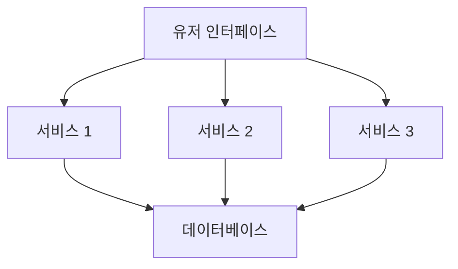
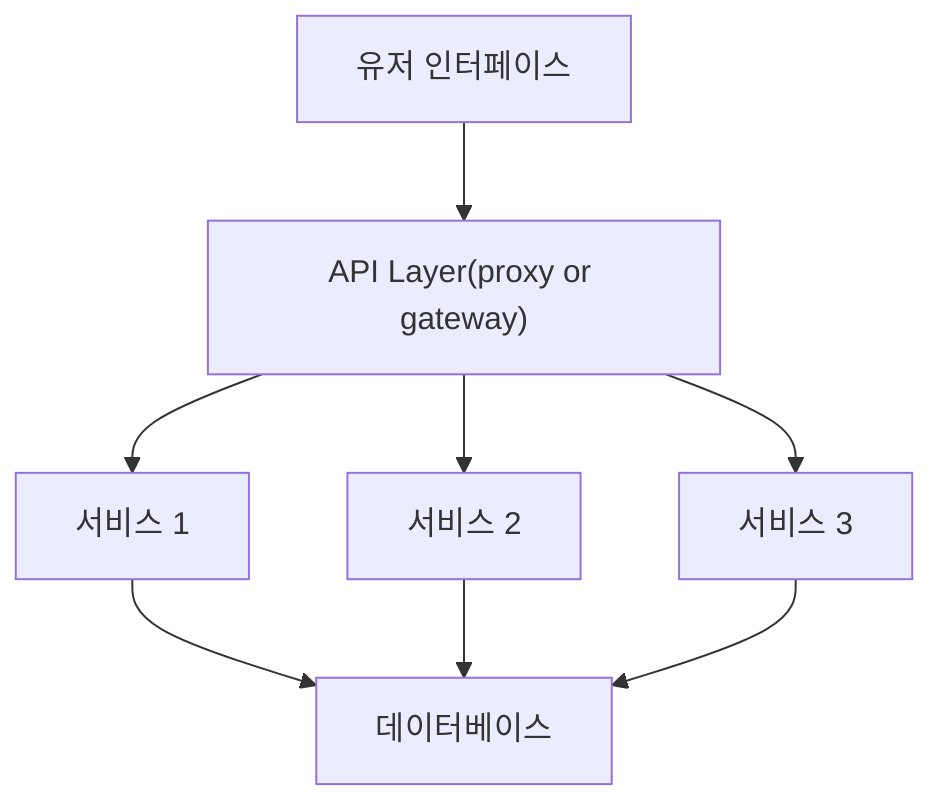

# 13. 서비스 기반 아키텍쳐 스타일

- 서비스 기반 아키텍쳐(Service-Based Architecture)는 마이크로서비스 아키텍쳐 스타일의 일종으로, 아키텍쳐가 유연해서  
  가장 실용적인 아키텍쳐 스타일 중 하나이다. 마이크로서비스나 이벤트 기반 아키텍쳐와 마찬가지로, 분산 아키텍쳐이지만 비교적 덜  
  복잡하고 비용이 많이 들지 않아 많은 비즈니스 관련 애플리케이션에 널리 채택된 아키텍쳐이다.

---

# 13.1 Topology

- 서비스 기반 아키텍쳐의 기본 토폴로지는, 각각 따로 배포된 유저 인터페이스와 원격 서비스, 그리고 모놀리스 데이터베이스로 이루어진  
  대규모 분산 layer 구조이다.

- 이 아키텍쳐 스타일에서 서비스는 큼지막한 단위로 분리되어 별도로 배포되는 '애플리케이션의 일부' 이다.  
  서비스를 배포하는 방식 자체는 여러 모놀리식 애플리케이션과 동일하므로, 컨테이너화가 필수는 아니다.  
  여러 서비스가 단일 데이터베이스를 공유하므로, 애플리케이션 서비스는 다 합해도 4~12개, 평균적으로 7개이다.

- 서비스 기반 아키텍쳐의 도메인 서비스는 각각 단일 인스턴스로 배포되지만, 확장성, 내고장성, 처리량 요구사항 등에 따라 인스턴스가  
  여러 개일 수도 있다. 서비스 인스턴스를 다수 생성해 배포하려면 UI로 유입된 요청이 가용한 서비스 인스턴스로 흘러갈 수 있도록  
  UI와 도메인 서비스 간의 부하 분산 기능이 필요하다.

- 서비스는 원격 액세스 프로토콜로 UI 외부에서 접근 가능하다. 프로토콜은 일반적으로 REST를 많이 사용하지만, messaging, RPC, SOAP도  
  사용 가능하다. UI는 proxy 혹은 gateway로 구성된 API layer를 통해 서비스에 접근할 수 있지만, 대개는 service locator pattern에  
  따라 UI, API gateway, proxy에 내장된 UI를 직접 접근한다.

- 서비스 기반 아키텍쳐는 중앙 공유 데이터베이스를 사용한다는 특징이 중요하다. 따라서 서비스는 기존 모놀리식 layered 아키텍쳐와 동일한 방식으로  
  SQL query와 JOIN 기능을 사용할 수 있다. 서비스 개수가 4~12개로 적어서, 데이터베이스 커넥션은 큰 문제가 되지 않지만, 데이터베이스 자체의  
  변경은 이슈가 될 수 있는데, 서비스 기반 아키텍쳐에서 데이터베이스 변경 문제를 다루는 방법은 뒷 부분에서 다룬다.

---

## 13.2 Topology 변형

- 서비스 기반 아키텍쳐 스타일은 특유의 유연성 때문에 정말 다양한 변형이 존재한다.  
  위에서 본 그림의 단일 모놀리식 UI는 다시 여러 UI 도메인으로 나눌 수 있고, 한발 더 나아가 각 도메인 서비스에 맞게 나눌 수도 있다.

- 또한 단일 모놀리식 데이터베이스 역시 개별 데이터베이스로 분리할 수 있고, 각 도메인 서비스 전용 데이터베이스들로 쪼갤 수도 있다.  
  여기서 중요한 점은, 각 데이터베이스에 있는 도메인 데이터를 다른 도메인의 서비스가 필요로 하지 않도록 설계하는 것이다.  
  그렇게 해야 도메인 서비스 간 상호 통신을 방지하고, 데이터베이스 간의 중복 데이터를 방지할 수 있다.

> 서비스 기반 아키텍쳐에서는 도메인 서비스 간의 상호 통신은 방지해야 한다.

- 마지막으로, 아래 그림처럼 reverse proxy 혹은 gateway로 구성된 API layer를 UI와 서비스 사이에 구성할 수도 있다.  
  도메인 서비스의 일부 기능(메트릭, 보안, 감사 요구사항, 서비스 디스커버리 등) 혹은 공통 관심사를 통합해 UI 밖으로  
  떼어낼 경우에도 유용한 방법이다.

---

## 13.3 서비스 설계 및 세분도

- 서비스 기반 아키텍쳐의 도메인 서비스는 보통 단위가 크기 때문에, 도메인 서비스를 API facade layer, 비즈니스 layer, persistence  
  layer로 구성된 layered 아키텍쳐 스타일로 설계하는 것이 일반적이다. 모듈러 모놀리스 아키텍쳐 스타일처럼 서브도메인을 이용해 각 도메인  
  서비스를 분할하는 방법도 많이 쓰인다.

- 서비스를 어떻게 설계하든 도메인 서비스는 UI 에서 비즈니스 기능을 호출하기 위해 접속할 일종의 API Access Facade를 필요로 한다.  
  API Access Facade는 UI를 통해 유입된 비즈니스 요청을 orchestrate 하는 역할을 한다.  
  예를 들어, UI에서 주문이 접수되면 이 단건 요청은 `OrderService` 도메인 서비스의 API Access Facade가 받아, 내부적으로  
  주문 처리, 주문 ID 생성, 결제 처리를 한 후 주문이 완료된 제품별 재고 업데이트를 하는 일련의 비즈니스 요청을 orchestrate 한다.  
  이런 요청을 MSA에서 처리한다면, 별도 배포된 다수의 전용 원격 서비스를 orchestrate 해야 한다. 세분도 관점에서 보면,  
  내부 클래스 수준의 orchestration과 외부 서비스의 orchestration이라는 차이점이 서비스 기반 아키텍쳐와 MSA의 중요한 차이점이다.

- 도메인 서비스는 세분도가 크기 때문에, 단일 도메인 서비스에서 데이터 무결성을 보장하기 위해 commit/rollback이 수반되는  
  ACID 데이터베이스 transaction을 사용하지만, MSA 처럼 분산도가 높은 아키텍쳐는 서비스를 더 잘게 나누어 BASE transaction이라고  
  알려진 분산 트랜잭션 기법을 활용한다. 이 기법은 기반이 최종 일관성이기에, 서비스 기반 아키텍쳐의 ACID 트랜잭션 레벨의 데이터 무결성은  
  지원하지 않는다.

> BASE transaction: Basic Availability, Soft state, Eventual Consistency

- 위에 서본 대로, 서비스 기반 아키텍쳐의 도메인 서비스는 ACID transaction의 활용이 가능하기 때문에 데이터 무결성 보장이 더 쉽지만,  
  MSA는 상당히 까다롭다. 하지만 서비스 기반 아키텍쳐도 tradeoff가 존재하는데, 서비스 기반 아키텍쳐에서 도메인 서비스의 기능을 변경할  
  일이 생기면 전체 서비스를 테스트해야 하지만, MSA 에서는 해당 기능이 구현된 비교적 규모가 작은 서비스 하나만 테스트하면 된다.  
  또한 서비스 기반 아키텍쳐는 코드가 점점 더 많이 배포될수록 문제를 일으킬 소지가 커지지만, MSA에서는 각 서비스가 한 가지 역할만  
  수행하므로 변경을 해도 다른 기능이 망가질 일이 거의 없다.

---

## 13.4 데이터베이스 분할

- 서비스 기반 아키텍쳐의 서비스는 (대부분) 주어진 애플리케이션 컨텍스트에서 서비스 수가 적은 편이라서, 보통 단일 모놀리식 데이터베이스를  
  공유한다. 그러나 이러한 데이터베이스 커플링은 테이블 스키마 변경 시 문제가 될 수 있다. 테이블 스키마를 올바르게 변경하지 않을 경우,  
  모든 서비스에 악영향을 미치기에 데이터베이스 변경은 여러모로 노력과 조정이 필요한 값비싼 작업이다.

- 서비스 기반 아키텍쳐에서 데이터베이스 테이블 스키마를 나타낸 공유 클래스 파일(shared class file, entity object)은  
  모든 도메인 서비스가 함께 사용하는 커스텀 공유 라이브러리에 둔다. SQL 코드도 이 라이브러리에 있을 것이다. Entity object가  
  공유하는 단일 라이브러리를 생성하는 기법은 서비스 기반 아키텍쳐 관점에서 가장 비효율적인 구현 방법이다.  
  테이블 구조를 조금이라도 변경하면 해당 entity object가 포함된 단일 공유 라이브러리도 함께 변경해야 하는데, 변경된 테이블의  
  사용 여부와 관계없이 전체 서비스를 일제히 변경 후 재배포할 수 밖에 없기 때문이다. 공유 라이브러리에 versioning을 도입하면 문제  
  해결에 약간의 도움은 되겠지만, 실제로는 어느 서비스가 실제로 테이블 변경에 영향 받을지를 미리 예측하기란 매우 까다롭다.

- 데이터베이스 변경 영향도와 리스크를 낮추는 한가지 방법으로, 데이터베이스를 논리적으로 분리하고 이러한 논리 분할을 연합 공유 라이브러리를  
  통해 명시하는 것이다. 이렇게 구성하면 특정 논리 도메인에 속한 테이블을 변경해도 해당 entity object가 포함된 공유 라이브러리를  
  사용하는 서비스만 영향받을 뿐, 그 밖의 서비스에는 영향이 없다.

> 서비스 기반 아키텍쳐에서는 데이터베이스 변경을 통제하기 위해 데이터 도메인을 올바르게 정의 및 관리하고, 데이터베이스는 가급적 논리적으로 잘게 나누는 것이 좋다.

---

## 13.5 언제 이 아키텍쳐 스타일을 사용하는가

- 서비스 기반 아키텍쳐는 도메인 주도 설계와 궁합이 잘 맞는다. 서비스를 큰 단위로 나누고, 그 범위를 도메인으로 한정하기에 각 도메인은 개별 배포된  
  도메인 서비스에 딱 맞아 떨어지는 것이다. 서비스 기반 아키텍쳐의 서비스는 각각 지정된 도메인을 포함하므로, 그 기능을 단일 소프트웨어 단위로  
  구분하면 해당 도메인을 더 쉽게 변경할 수 있다.

- 분산 아키텍쳐에서는 데이터베이스 트랜잭션을 관리 및 조율하는 일이 항상 골칫거리인데, 전통적인 ACID transaction이 아닌, 최종 일관성에  
  의존하는 방식으로 수행되기 때문이다. 그러나 서비스 기반 아키텍쳐의 도메인 서비스는 큰 단위로 구성되므로, 다른 분산 아키텍쳐에 비해  
  ACID transaction이 더 잘 보장된다. UI나 API gateway가 둘 이상의 도메인 서비스를 orchestrate 하는 경우도 있는데,  
  이럴 때에는 트랜잭션이 Saga와 BASE transaction에 의존해야 한다. 그러나 대부분의 트랜잭션은 특정 도메인 서비스에 한정되므로  
  거의 모든 모놀리식 애플리케이션에서 찾아볼 수 있는 전통적인 commit/rollback 트랜잭션 기능은 모두 사용 가능하다.

- 마지막으로, 서비스 기반 아키텍쳐는 복잡하게 뒤엃기허간 세분도의 함정에 빠져 허우적거리지 않고도, 아키텍쳐 모듈성을 괜찮은 수준으로  
  달성할 수 있다. 서비스를 더 잘게 나눌수록 orchestration 및 coreography 관련 이슈가 발생하기 시작하는데, 여러 서비스를  
  조율해 비즈니스 트랜잭션을 완성하려면 orchestration과 coreography 둘 다 필요하다.  
  Orchestration은 트랜잭션의 워크플로우를 제어, 관리하는 중재자 서비스를 따로 두고 여러 서비스를 조율하는 방법을 의미하고,  
  coreography는 각 서비스가 중앙 중재자 없이 서로가 알아서 소통하는 방식을 의미한다.  
  서비스가 더 잘게 쪼개지면 비즈니스 트랜잭션을 완성하기 위해 서비스를 서로 단단히 묶어주는 orchestration과 coreography가 필요해진다.
  그러나 서비스 기반 아키텍쳐의 서비스는 더 큰 단위로 나뉘는 편이라서, 다른 분산 아키텍쳐 만큼 정교한 조율이 필요하지는 않다.

---
