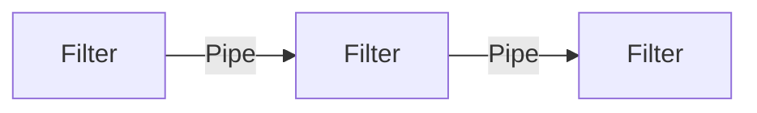
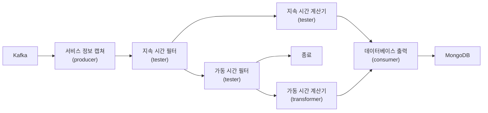

# 11. 파이프라인 아키텍쳐 스타일

- 파이프라인 아키텍쳐(Pipeline Architecture)는 소프트웨어 아키텍쳐에서 끊임없이 등장하는 기본적인 아키텍쳐 스타일이다.  
  개발자와 아키텍트가 기능을 개별 파트로 분리하기로 결졍하는 순간부터 이 패턴이 수반된다.  
  이 아키텍쳐는 Bash, Zsh 같은 unix terminal shell 언어의 기초 원리이기도 하다.

- 함수형 언어의 개발자는 언어 구조(language construct)와 이 아키텍쳐 요소가 유사하다고 생각할 것이다.  
  MapReduce 프로그래밍 모델을 응용한 많은 도구가 이 기본 topology를 따르고 있다.  
  이처럼 파이프라인 아키텍쳐 스타일은 저수준에서 구현할 수도 있고, 고수준의 비즈니스 애플리케이션에도 적용 가능하다.

---

## 11.1 Topology

- 파이프라인 아키텍쳐는 다수의 pipe와 filter로 구성된다.

### 11.1.1 Pipe

- Pipe는 한 소스에서 입력을 받아 다른 소스로 출력을 내는, 필터 간의 통신 채널이다.  
  파이프는 성능상 이유로 보통 단방향, 점대점 방식으로 구성한다. 파이프를 오가는 payload의 데이터는 어떤 포맷으로도 가능하지만,  
  아키텍트는 고성능에 유리한 적은 양의 데이터를 선호한다.

### 11.1.2 Filter

- Filter는 자기 완비형(self-contained)이고, 다른 필터와 독립적이며, 일반적으로 stateless하다.  
  Filter는 단 하나의 task만 수행하므로 복합적인 task는 여러 filter를 이어 붙여 처리하게 된다.

- 파이프라인 아키텍쳐 스타일에서 filter는 아래 4가지 종류가 있다.

  - Producer: 프로세스의 시작점이다. Outbound만 있기에 source 라고도 한다.
  - Transformer: 입력을 받아 필요 시 일부 또는 전체 데이터를 변환한 후, 그 결과를 outbound pipe로 전달한다.  
    함수형 프로그래밍에서는 map에 해당한다.
  - Tester: 입력을 받아 하나 이상의 기준(criteria)에 대해 테스트하고, 결과에 따라 필요 시 결과를 생상한다.  
    함수형 프로그래밍에서는 reduce에 해당한다.
  - Consumer: 파이프라인 흐름의 종착지로, consumer는 파이프라인 프로세스의 최종 결과를 database에 저장하거나, UI에 표시한다.

- 각 파이프와 필터는 단방향이고 워낙 단순해 얼마든지 조합할 수 있다.

---

## 11.2 예제

- 파이프라인 아키텍쳐 패턴은 다양한 애플리케이션, 특히 간단한 단방향 처리 태스크에서 흔히 찾아볼 수 있다.  
  예를 들어, EDI(Electronic Data Interchange, 전자 데이터 교환) 도구는 대부분 이 패턴에 따라 파이프와 필터로 한 종류의  
  문서를 다른 종류의 문서로 변환한다. ETL 도구 역시 다른 데이터베이스나 데이터소스로 데이터를 변환해 흘릴 때, 파이프라인 아키텍쳐를  
  활용한다. Apache Camel 같은 orchestrator 와 mediator는 파이프라인 아키텍쳐를 기반으로 정보를 다음 비즈니스 단계로 전달한다.

- 아래 그림을 보면서 파이프라인 아키텍쳐의 쓰임새를 보자. 다양한 서비스의 telemetry(원격 계측) 정보를 Apache Kafka에 streaming하는 예제이다.

- 서로 다른 종류의 데이터를 kafka에 streaming 처리하는 파이프라인 아키텍쳐 스타일을 보자.  
  Producer fileter는 카프카 토픽을 구독해 서비스 정보를 받아 이 데이터를 `지속 시간 필터` 에 보내고, 카프카에서 받아온 데이터가  
  요청 지속 시간과 연관되어 있는지 판단한다. 필터마다 관심사도 다르고 분리되어 있다. `서비스 정보 캡쳐 필터` 는 카프카 토픽에 연결하는  
  일만 신경을 쓰고, `지속 시간 필터` 는 데이터 검증 후 필요 시 다음 파이프에 보내는 작업만 한다.  
  만약 데이터가 서비스 요청 지속 시간과 관련이 있으면, `지속 시간 필터` 는 이 데이터를 `지속 시간 계산기` 필터에 보내고,  
  연관이 없다면 `가동 시간 필터`로 보내 데이터가 가동 시간 메트릭과 관련있는지 체크한다. 가동 시간 메트릭과 관련이 없으면 해당 데이터는  
  이 특정한 처리 흐름에 쓸모가 없으므로 파이프라인은 즉시 종료된다. 반대로 가동 시간 메트릭과 관련이 있다면 `가동 시간 계산기` 필터로  
  보내 해당 서비스의 가동 시간 메트릭을 계산한다. 이 두 변환기는 수정된 데이터를 `데이터베이스 출력` 필터에 보내고 결과적으로  
  MongoDB에 저장한다.

- 위 예제는 파이프라인 아키텍쳐의 확장성을 잘 나타낸다. 만약 위 아키텍쳐에서 새로운 메트릭을 데이터베이스에 전달해야할 경우, 간단히  
  `가동 시간 필터` 다음에 tester filter를 하나 추가하면 된다.

---

## 11.3 아키텍쳐 특성 등급

| 아키텍쳐 특성 | 별점 |
| ------------- | ---- |
| 분할 유형     | 기술 |
| 퀀텀 수       | 1    |
| 배포성        | 2    |
| 탄력성        | 1    |
| 진화성        | 1    |
| 내고장성      | 1    |
| 모듈성        | 1    |
| 전체 비용     | 5    |
| 성능          | 2    |
| 신뢰성        | 3    |
| 확장성        | 1    |
| 단순성        | 5    |
| 시험성        | 3    |

- 파이프라인 아키텍쳐 스타일은 애플리케이션 로직을 필터 타입(producer, tester, transformer, consumer)에 따라 나누는  
  기술 분할 아키텍쳐이다. 또한 이 아키텍쳐는 보통 모놀리식 형태로 구현 및 배포하므로 아키텍쳐 퀀텀은 언제나 1이다.

- 이 아키텍쳐의 주요 장점은 모듈성과 결부된 전체 비용 및 단순성이다.  
  원래 모놀리식에 가깝기에 분산 아키텍쳐 스타일에 수반되는 복잡도가 없고, 단순해서 알기 쉬우며 구축 및 유지보수 비용도 비교적 적다.  
  다양한 필터 타입과 변환기 간의 관심사를 분리함으로써 아키텍쳐 모듈성을 확보할 수 있고, 필터를 교체, 수정하더라도 다른 필터에는  
  아무런 영향을 미치지 않는다.

- 평균 수준으로 매겨진 배포성, 시험성은 필터를 통한 필터를 통한 모듈성이 더 우수하므로 layered 아키텍쳐보다는 조금 낫다.  
  그래도 모놀리식이기에 절차, 리스트, 배포 빈도, 테스트 완성도의 영향을 받는다.

- Layered 아키텍쳐와 마찬가지로 분산 아키텍쳐에서 자주 목격되는 네트워크 트래픽, 대역폭 부족, latency 탓에 전체 신뢰성은 3점이다.  
  시험성, 배포성 문제와 더불어 모놀리식 배포 특유의 고질적인 문제점(조금만 수정해도 전체 배포) 탓에 3점이다.

- 이 아키텍쳐의 탄력성과 확장성은 모놀리식 배포 때문에 1점이다. 모놀리식 내부 기능 중에는 더러 확장 가능한 것들도 있지만,  
  확장을 하려면 대부분 멀티스레딩, 내부 메시징을 비롯해 이 아키텍쳐와는 어울리지 않는 갖가지 병렬 처리 practice와 기법이 동원된다.  
  그러나 파이프라인 아키텍쳐는 UI, 백엔드 처리, 데이터베이스 구조가 모놀리식이므로 언제나 단일 시스템 퀀텀이고, 애플리케이션은  
  단일 퀀텀을 기반으로 특정 지점까지만 확장이 가능하다.

- 파이프라인 아키텍쳐는 모놀리식 배포 탓에, 또 부족한 아키텍쳐 모듈성 때문에 내고장성도 별로다.  
  어느 작은 부분에 OOM이 발생하면 애플리케이션 전체적으로 영향을 받고 충돌이 발생한다. 또한 대부분의 모놀리식 애플리케이션이 겪는  
  MTTR 때문에 소규모 애플리케이션은 2분, 대규모 애플리케이션은 15분 이상의 가동 시간이 소요되며, 그만큼 전체 가용성도 영향 받는다.

---
