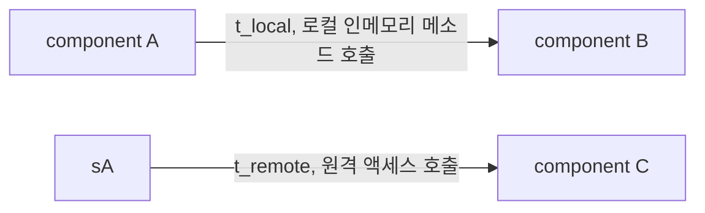
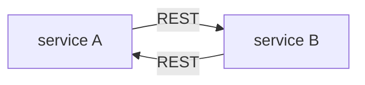
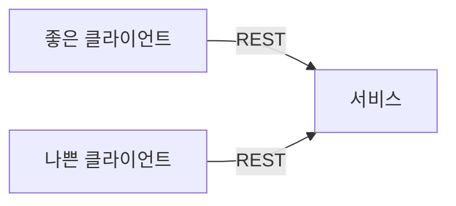

# 9. 기초

- 아키텍쳐 스타일은 종종 아키텍쳐 패턴이라고도 불리고, 다양한 아키텍쳐 특성을 다루는 컴포넌트의 명명된 관계(named relationship)을 기술한다.
- 아키텍쳐 스타일은 각 명칭마다 설계 패턴의 존재 이유이기도 한 상당히 많은 세부 내용이 함축되어 있다.  
  또한 아키텍쳐 스타일은 topology와 기본 전제된 아키텍쳐 특성을, 이로운 것 과 해로운 것 모두를 기술한다.

---

## 9.1 기초 패턴

- 소프트웨어 아키텍쳐의 역사를 통틀어 끊임없이 나타나고 또 나타나는 패턴이 있는데, 이런 패턴들은 코드, 배포, 또는 아키텍쳐의 다른  
  부분을 구성하는 시야를 넓혀준다.

### 9.1.1 진흙잡탕

- 뭐 하나 뚜렷한 아키텍쳐 구조가 전무한 상태를 진흙잡탕(big ball of mud)라 한다.

> 진흙잡탕은 대충 되는대로, 아무렇게나 막 지저분하게, 테이프를 덕지덕지 붙여놓은 스파게티 코드 정글이다.
> 이런 시스템은 거의 반드시 무질서한 성장과 반복적인 땜질실 수리의 징후를 보인다.
> 정보는 널리 떨어진 시스템 파트끼리 난잡하게 공유되고, 거의 모든 중요한 정보는 전역에 흩어져 있거나 중복된 경우도 많다.

- 요즘 시대에서 진흙잡탕은 보통 실제 내부 구조라 할 만한 것은 하나도 없는, DB를 직접 호출하는 이벤트 핸들러를 가진 단순한  
  스크립팅 애플리케이션을 가리킨다. 보통 이렇게 별 대수롭지 않게 시작한 애플리케이션이 나중에 점점 규모가 커져 처치 곤란 상태가 된다.

### 9.1.2 Utinary 아키텍쳐

- 아키텍쳐 태동기에는 단 1대의 컴퓨터에서 소프트웨어가 돌아갔다. 이후 하드웨어, 소프트웨어의 다양한 진화 세대를 거치며 처음에는  
  단일 entity로 시작했다가 정교한 기능이 점점 더 많이 필요해지면서 나누었다.  
  예를 들어, mainframe 컴퓨터는 원래 단일 시스템이었지만 점점 갈수록 데이터를 고유한 시스템으로 분리했다.  
  PC도 처음 출시된 시절에 상업용 개발은 대부분 단일 머신에 초점을 두었지만, 네트워크가 보편화되면서 분산형 시스템이 등장했다.

- 이제 unitary(단일, 통일) 시스템은 embedded 시스템과 그 밖에 매우 제약이 많은 극소수 환경을 제외하면 거의 쓰이지 않는다.  
  소프트웨어 시스템은 시간이 지날수록 점점 기능이 늘어나기 마련이므로 성능, 확장 등의 운영 아키텍쳐 특성을 유지하려면  
  관심사를 분리할 필요가 있다.

### 9.1.3 Client/Server

- 시간이 갈수록 단일 시스템에서 여러 기능을 분리할 필요성이 대두되었고, 그 분리방법은 많은 아키텍쳐 스타일의 기초가 되었다.  
  실제로 대부분의 아키텍쳐 스타일은 시스템에 있는 여러 부분을 효과적으로 분리하는 방법을 다룬다.

- Frontend, Backend로 기술적으로 기능을 분리한 2-tier 또는 Client/Server 아키텍쳐는 대표적인 기본 아키텍쳐 스타일이다.  
  이 아키텍쳐는 시대와 컴퓨팅 파워에 따라 여러 가지 형태로 존재해왔다.

#### Desktop + Database server

- 초창기 PC 아키텍쳐는 개발자가 Windows와 같은 UI를 기반으로 rich desktop application을 개발하도록 적극 지원했다.  
  데이터는 별도의 DB 서버로 분리했다. 이 아키텍쳐는 표준 네트워크 프로토콜을 통해 접속 가능한 standalone DB 서버와  
  잘 맞았다. 덕분에 presentation 로직은 desktop에 두고, 계산량이 많은 액션은 사양이 탄탄한 DB server에서 실행했다.

#### Browser + Web server

- 현대 앱 개발 시대가 도래하며 웹 브라우저가 웹 서버에 접속하는 형태로 분리하는 것이 일반화되었다.  
  이로써 클라이언트는 desktop보다 훨씬 가벼운 브라우저로 대체되었고, 내외부 방화벽 모두 더 넓은 범위로 배포가 가능해졌다.  
  DB는 웹 서버와 분리되어 있지만, 두 서버 모두 운영 센터 내부와 동급 머신에서 운용되고, UI는 브라우저에서 실행되므로  
  여전히 이 구조를 2-tier 아키텍쳐로 바라보는 사람들도 있다.

### 3-tier

- 3-tier는 더 많은 layer로 분리한다.  
  Java, .NET 진영에서 애플리케이션 서버 같은 도구가 보급되고, 기업들은 더 많은 layer를 topology에 구축하기 시작했다.  
  그 결과 고성능 DB 서버를 사용하는 Database tier, 애플리케이션 서버가 관리하는 Application tier, 그리고 처음에는  
  HTML로 시작해 기능이 점점 많아져 온갖 JS 코드로 가득 찬 Frontend tier, 이렇게 3개 tier가 완성되었다.

- 3-tier 아키텍쳐는 분산 아키텍쳐에 적합한 공통 객체 요청 브로커 아키텍쳐(Common Object Request Broker Architecture, COBRA),  
  분산 컴포넌트 객체 모델(Distributed Component Object Model, DCOM) 같은 네트워크 수준의 프로토콜과 잘 맞았다.

- 요즘은 TCP/IP 같은 네트워크 프로토콜이 어떻게 작동하는지 개발자가 신경 쓰지 않아도 되는 것처럼, 아키텍트도 분산 아키텍쳐에서  
  이 정도 수준의 연결 작업에 대해서는 그리 걱정하지 않아도 된다. 당시 개발된 도구가 제공하는 기능들이 오늘날에도 여전히  
  message queue 같은 도구 혹은 이벤트 기반 아키텍쳐 등의 아키텍쳐 패턴에 존재하기 때문이다.

---

## 9.2 Monolithic vs Distributed Architecture

- 아키텍쳐 스타일은 크게 전체 코드를 단일 단위로 배포하는 모놀리식과, 여러 단위로 배포하는 분산형, 두 종류로 나뉜다.
- 분산 아키텍쳐 스타일은 모놀리식 아키텍쳐 스타일에 비해 성능, 확장성, 가용성 측면에서 훨씬 강력하지만, 이런 장점에도 결국  
  무시할 수 없는 tradeoff가 수반된다. 모든 분산 아키텍쳐에서 처음 맞닥뜨리게 되는 이슈들은 `'the fallacies of distributed computing`  
  이라는 글에서 최초로 거론되었다. 여기서의 오류(fallacy)는 옳다고 믿거나 가정하지만, 사실은 틀린 것을 말한다. 하나씩 보자.

### 9.2.1 오류 1: 네트워크는 믿을 수 있다.

- 네트워크는 믿을 수 없다. 네트워크의 신뢰도는 점점 좋아지고 있지만, 여전히 아직도 미덥지 못한게 사실이다.  
  분산 아키텍쳐는 그 특성상 서비스를 오가는, 또 서비스 간에 이동하는 네트워크에 의존하므로 이는 매우 중요한 문제이다.  
  하나의 서비스가 정상이어도 네트워크 문제로 인해 다른 서비스와 연결이 끊겨, 원하는 일을 못하게 될 수 있다.  
  그래서 timeout 같은 장치를 마련하거나, 서비스 사이에 circuit breaker를 두는 것이다.  
  시스템이 MSA 처럼 네트워크에 더 의존하게 될수록 시스템의 신뢰도는 잠재적으로 떨어질 가능성이 있다.

### 9.2.2 오류 2: Latency는 0이다.

- 메소드 혹은 함수를 이용해 다른 컴포넌트를 local에서 호출하면 그 소요 시간(`t_local`)은 대개 nano 혹은 ms 단위에 그치지만,  
  동일한 호출을 REST, Messaging, RPC 등의 원격 액세스 프로토콜을 통해 수행하면 서비스 액세스 시간(`t_remote`)이  
  ms 단위로 늘어난다. 따라서 `t_remote`는 항상 `t_local`보다 클 수밖에 없고, 모든 분산 아키텍쳐에서 latency는 0이 아니다.

- 어떤 분산 아키텍쳐를 구축하든지 간에 평균 latency는 반드시 알아야 한다. 이것이 분산 아키텍쳐가 실현 가능한지를 판단하는  
  유일한 방법이다. 특히 MSA 에서는 서비스가 잘게 나뉘기에 서비스 간 통신량도 만만치 않다.

### 9.2.3 오류 3: Bandwidth은 무한하다.

- 모놀리식 아키텍쳐는 비즈니스 요청을 처리하는 데 그리 큰 대역폭이 필요하지 않으므로, 대역폭이 문제가 될 일은 별로 없다.  
  하지만 MSA에서 시스템이 자잘한 배포 단위(서비스)로 쪼개지면, 이 서비스들 간에 주고받는 통신이 대역폭을 상당히 점유해  
  네트워크가 느려지고, 결국 latency와 신뢰성에도 영향을 미친다.

- 위 그림을 보자. 각 서비스는 서로 필요한 데이터를 가져오기 위해 자주 네트워크 호출이 발생된다.  
  하지만 위처럼 순환이 생기면 이를 stamp coupling이라 한다.

- Stamp coupling은 분산 아키텍쳐에서 상당히 많은 대역폭을 차지한다. 이 문제는 아래의 방법들로 해결할 수 있다.

  - Private REST API endpoint를 둔다.
  - Contract에 field selector를 둔다.
  - GraphQL로 contract를 분리한다.
  - CDC(Consumer-Driven Contract)와 VDC(Value-Driven Contract)를 사용한다.
  - 내부 messaging endpoint를 사용한다.

- 어떤 기법을 적용하든, 분산 아키텍쳐의 서비스 또는 시스템 간에 최소한의 데이터만 주고받도록 하는 것이 이 오류를 바로잡는 최선의 길이다.

### 9.2.4 오류 4: 네트워크는 안전하다.

- 개발자, 아키텍트는 대부분 VPN, trusted network, 방화벽에 너무 익숙해진 나머지, 네트워크가 안전하지 않다는 사실을 망각하곤 한다.  
  보안은 분산 아키텍쳐에서 훨씬 더 어려운 문제다. 위 그림처럼 분산 배포된 endpoint는 알려지지 않은, 또는 악의적인 요청이 해당  
  서비스로 유입되지 않게 철저한 보안 대책을 강구해야 한다. 모놀리식에서 분산 아키텍쳐로 옮아가면서, 더 넓은 영역이 악의적인 외부인의  
  위협과 공격에 노출된다. 모든 endpoint에, 서비스간 통신에도 보안이 적용되어야 하므로 MSA나 서비스 기반 아키텍쳐처럼  
  고도로 분산된 동기 아키텍쳐에서 당연히 성능이 떨어질 수밖에 없다.

### 9.2.5 오류 5: Topology는 절대 안바뀐다.

- 네트워크를 구성하는 모든 router, hub, switch, 방화벽 등 전체 네트워크 topology가 불변일 것이란 가정은 섣부른 오해이다.  
  네트워크 topology는 당연히 변한다. 그런데 이 오류가 왜 중요할까?

- 프로덕션 서비스가 배포된 적이 없는데, 자꾸 오류가 timeout을 일으키며 오류가 난다고 해보자. 알고보니 이 문제는 네트워크팀이  
  새벽에 진행한 '소소한 업그레이드 작업'의 영향이었다. 이 '소소한' 작업이 모든 latency의 용의자 뒤에 숨어 timeout을 일으키고  
  circuit breaker를 작동시킨 주범이었던 것이다.

- 아키텍트는 운영자, 네트워크 관리자와 항시 소통하며 무엇이, 언제 변경되었는지 알고 있어야 한다.  
  그래야 위와 같은 당황스러운 사태가 발생해도 적절히 대응할 수 있다.

### 9.2.6 오류 6: 관리자는 한 사람 뿐이다.

- 네트워크 관리자는 보통 수십명에 달하고, 그렇기에 분산 아키텍쳐는 복잡할 수 밖에 없고, 모든 것을 잘 운영하려면 상당히 많은 조율 과정이 불가피하다.

### 9.2.7 오류 7: 운송비는 0이다.

- 많은 사람들이 이를 `오류 2: Latency는 0이다` 와 헷갈리는데, 여기서 말하는 _운송비_ 는 latency가 아니라, '단순한 REST 호출'을  
  하는 데 소요되는 _진짜 비용(actual cost)_ 를 말한다. 대부분의 경우, 분산 아키텍쳐는 하드웨어, 서버, 게이트웨이, 방화벽,  
  신규 서브넷, 프록시 등 리소스가 더 많이 동원되므로 모놀리식 아키텍쳐보다 훨씬 더 비용이 든다.

### 9.2.8 오류 8: 네트워크는 균일하다.

- 아키텍트, 개발자는 대부분 네트워크가 균일(homogeneous)하다, 즉 어느 네트워크 하드웨어 업체 한 곳에서 모든 장비를 다 만들었다고  
  착각한다. 하지만 실제로는 한 회사의 인프라가 여러 업체의 네트워크 하드웨어 제품들이 얽히고 설켜있는 경우가 대다수이다.

- 요지는 온갖 종류의 하드웨어가 서로 다 잘 맞물려 동작하는 것은 아니라는 것이다. 대부분 그럭저럭 작동할지 몰라도, Juniper 사의  
  하드웨어가 Cisco 사의 하드웨어와 딱 맞물려 작동될까? 네트워크 표준 자체는 큰 문제가 안될 수 있지만, 모든 상황과 부하, 환경에서  
  100% 완벽한 테스트를 마친 것은 아니므로 실제로 간혹 네트워크 패킷이 유실되는 사고도 심심찮게 발생한다. 이는 결국 네트워크의  
  신뢰성, latency, 대역폭에 영향을 미칠 것이다.

### 9.2.9 다른 분산 아키텍쳐 고려 사항

- 위의 8가지 오류와 더불어, 모놀리식 아키텍쳐에는 없지만 분산 아키텍쳐를 설계할 때 맞닥뜨리게 될 이슈 및 해결해야 할 난제들이 있다.

#### 분산 로깅

- 분산 아키텍쳐는 애플리케이션과 시스템 로그가 분산되어 있으므로, 어떤 데이터가 누락된 근본 원인을 밝히기가 대단이 어렵고 시간도 많이 걸린다.  
  모놀리식 애플리케이션은 로그가 하나여서 요청을 추적해 이슈를 특정하기 쉽지만, 분산 아키텍쳐는 로그 종류만 해도 수백 가지에 달하고  
  위치도 제각각, 포맷도 제각각이라 문제를 집어내기가 까다롭다.

- Splunk 같은 통합 로깅 도구를 사용하면 다양한 소스와 시스템에서 통합된 로그 및 콘솔로 데이터를 취합할 수 있지만, 복잡하기 그지없는  
  분산 로그를 확인하기에는 역부족이다.

#### 분산 트랜잭션

- 모놀리식 아키텍쳐 세계는 직관적이고 관리가 편한 트랜잭션을 당연시한다.  
  Persistence 프레임워크가 대신 실행하는 표준 commit/rollback 기능은 ACID 트랜잭션을 걸어 업데이트 시 데이터 일관성과  
  무결성을 강제한다. 하지만 분산 아키텍쳐는 사정이 다르다.

- 분산 아키텍쳐는 최종 일관성(eventual consistency) 개념을 바탕으로 별도로 분리된 배포 단위에서 처리된 데이터를 미리 알 수 없는  
  어느 시점에 모두 일관된 상태로 동기화한다. 확장성, 성능, 가용성을 얻는 대가로 데이터 일관성과 무결성을 희생하는 tradeoff이다.

- 분산 트랜잭션을 관리하는 한 가지 방법으로 transactional saga가 있다. Saga는 보상을 위해 이벤트를 sourcing하거나  
  트랜잭션 상태 관리를 위한 FSM(Finite State Machine)을 사용한다. Saga외에 BASE 트랜잭션도 있다.  
  BASE는 (BA)sic availablity(기본 가용성), (S)oft state(소프트 상태), (E)ventual consistency(최종 일관성)의 약자이다.  
  BASE 트랜잭션은 어떤 소프트웨어 조각이 아니라, 일종의 기법이다. Soft state는 source->target 로의 데이터 전달과  
  데이터 소스 간 비일관성을 말한다. 시스템 또는 서비스의 기본 가용성에 따라 시스템은 아키텍쳐 패턴과 메시징을 활용해 결국 언젠가  
  일관되게 맞춰질 것이다.

#### Contract 관리 및 versioning

- Contract의 생성, 유지보수, versioning 역시 분산 아키텍쳐에서 다소 까다롭다.  
  Contract는 클라이언트와 서비스 모두 합의한 행위와 데이터를 말한다. 분산 아키텍쳐에서는 분리된 서비스와 시스템을 제각기 다른  
  팀과 부서가 소유하기에 contract의 유지보수가 특히 어렵다. Version deprecation에 필요한 통신 모델은 더 더욱 복잡하다.

---
