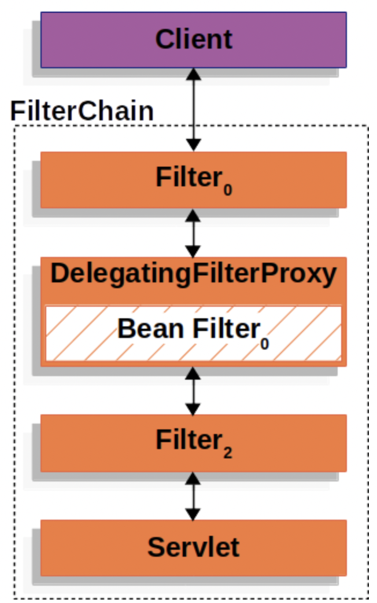
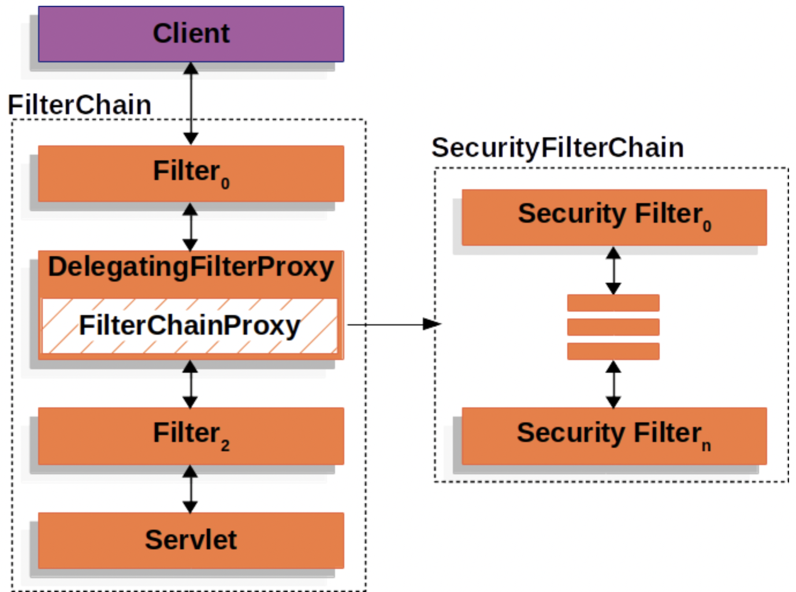
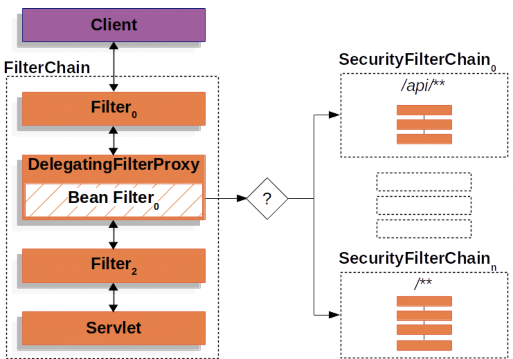

<h1>Filters with Spring</h1>

<h2>DelegatingFilterProxy</h2>

- Spring은 `Filter`의 구현체 중 하나인 `DelegatingFilterProxy`라는 객체를 제공한다.  
  이 객체는 Servlet Container의 생명 주기와 Spring의 `ApplicationContext`를 이어주는 역할을 한다.

- Servlet Container에는 `Filter`들을 등록할 수 있지만, Spring Bean들에 대해서는 자체적으로 알지 못한다.  
  이를 해결하는 것이 `DelegatingFilterProxy`객체이다. 이 객체를 사용하면 Spring Bean들을 사용하는  
  `Filter`들을 Servlet Container에 등록할 수 있다.

- 아래 그림은 `DelegatingFilterProxy`가 `Filter`들과 `FilterChain`에서 하는 역할을 그린 것이다.



- `DelegatingFilterProxy`는 `ApplicationContext`에 있는 Bean Filter를 찾아보고, 해당 Bean Filter의  
  작업을 호출한다. 아래는 `DelegatingFilterProxy`의 Pseudo code이다.

```java
public void doFilter(ServletRequest request, ServletResponse response, FilterChain chain) {
    // Spring Bean으로 등록된 Filter들을 Lazy 방식으로 찾는다.
    Filter delegate = getFilterBean(beanName);

    delegate.doFilter(request, response);
}
```

- `DelegatingFilterProxy`의 또다른 장점은 bean으로 등록된 `Filter`들을 찾는 작업을 Lazy하게 해준다는 것이다.  
  Spring은 `ContextLoaderListener`를 사용하여 Spring Bean들을 불러오는데,  
  이 과정은 `Filter` 인스턴스들이 등록되어야 할 때 까지 수행되지 않는다.  
  이것이 중요한 이유는 컨테이너가 시작되기 전에 컨테이너에 `Filter` 인스턴스들을 먼저 등록해야 하기 때문이다.  
  즉 무조건 `Filter`들이 컨테이너에 등록되는 것을 막고, Spring Bean으로 등록된 `Filter`들을 필요할 때에  
  `ContextLoaderListener`가 불러오게끔 한다는 것이다. 만약 이 과정이 생략된다면 Spring Bean으로 등록된 `Filter`들은  
  Servlet Container에 등록되지 못할 것이다.(위에서 말했듯이 Servlet Container는 Spring Bean들에 대해 모르기 때문)

<hr/>

<h2>FilterChainProxy</h2>

- Spring Security의 Servlet에 대한 지원은 `FilterChainProxy`가 담당한다.  
  `FilterChainProxy`는 Spring이 제공하는 특별한 `Filter`인데,  
  `SecurityFilterChain`을 통해 여러 개의 Security `Filter`들에게 작업을 위임할 수 있도록 한다.  
  `FilterChainProxy`는 bean 객체이기에 `DelegatingFilterProxy`에 포함되어 있다.


<hr/>

<h2>SecurityFilterChain</h2>

- `SecurityFilterChain`은 `FilterChainProxy`에 의해 사용되는데, 해당 요청에 어떤  
  Spring Security Filter들이 작동할지를 정의할 수 있다.

- 아래 그림은 `SecurityFilterChain`이 적용되는 구조이다.



- `SecurityFilterChain`내에 있는 Security Filter들은 Spring Bean들인데, 이들은 `DelegatingFilterProxy` 대신  
  `FilterChainProxy`를 사용한다. `FilterChainProxy`를 사용하는 것은 직접 Servlet Container에 Filter를 등록하는 것과  
  `DelegatingFilterProxy`를 사용하는 것에 비해 다양한 이점을 제공하는데, 이점들은 아래와 같다.

  - Spring Security의 Servlet에 대한 지원의 시작점이 된다. 따라서 만약 코드를 디버깅 하려면, `FilterChainProxy`에  
    디버그용 코드를 작성하면 된다.
  - `FilterChainProxy`가 Spring Security의 중심과 같은 역할을 하기 때문에, 선택적으로 수행되는 작업이 아닌  
    항상 수행되어야 할 작업을 정의할 수 있다. 예를 들어, Spring은 내부적으로 여기서 `SecurityContext`를 모두 메모리 해제하여  
    메모리 누수를 막아준다.
  - 마지막으로 만약 여러 개의 `SecurityFilterChain`들이 있다면, 이 중 특졍 요청이 오면 어떤 `SecurityFilterChain`이 작동해야  
    하는 지에 대해 정의하기가 쉽다. Servlet Container내에서, `Filter`들은 URL에 의해 작동 여부가 결정된다.  
    하지만 `FilterChainProxy`를 사용하면, URL에 의한 것이 아니라 `RequestMatcher` 인터페이스를 사용해서  
    `HttpServletRequest`에 대해 특정 작업을 수행할 수 있도록 할 수 있다.

- 위에서 말했듯이, `FilterChainProxy`는 여러 개의 `SecurityFilterChain` 중 어떤 `SecurityFilterChain`이  
  호출될 것인지를 결정할 수 있다. 이는 애플리케이션의 엔드포인트 마다 전혀 다른 필터 및 설정을 할 수 있도록 해준다.  
  아래 그림은 여러 개의 `SecurityFilterChain`이 `FilterChainProxy`에 적용된 모습이다.



- 위 그림에서 `FilterChainProxy`는 어떤 `SecurityFilterChain`이 사용될지를 결정할 수 있다.  
  `FilterChainProxy`의 조건 중 첫 번째 조건을 만족하는 `SecurityFilterChain`이 작동된다.  
  만약 `/api/messages/`의 URL에 대해 요청이 들어왔다면, 위 그림에서 `SecurityFilterChain(0)`의 URL 패턴인  
  `/api/**`를 만족하기 때문에 `SecurityFilterChain(0)`이 수행될 것이다. 그 후에 만족되는 `SecurityFilterChain` 조건이  
  있더라도 단 하나의 `SecurityFilterChain`만 호출하게 된다.

- 만약 `/messages/`에 대한 요청이 들어요먼, 이 엔드포인트는 `SecurityFilterChain(0)`의 `/api/**` 패턴과 일치하지  
  않으므로 `FilterChainProxy`는 `/messages/`의 패턴에 맞는 `SecrityFilterChain`을 계속해서 찾아갈 것이다.

- 유의할 점은, 각 `SecurityFilterChain`들은 완전히 독립적으로 작동한다는 것이다.  
  위 그림만 봐도 `SecurityFilterChain(0)`는 3개의 Filter가 있지만, `SecurityFilterChain(n)`에는  
  4개의 필터가 있다. 이렇게 각 `SecurityFilterChain`들은 서로 독립적이며, 완전히 다른 설정을 각각 가질 수 있다.

- 만약 특정 요청 패턴에 대해 Spring Security가 작동하는 것을 방지하게끔 하고 싶다면  
 `SecurityFilterChain에 Security Filter를 하나도 안 넣으면 된다.
<hr/>

<h2>Security Filters</h2>

- Security Filter들은 `SecurityFilterChain` API를 통해 `FilterChainProxy`에 등록된다.  
   각 `Filter`들이 적용된 순서는 당연히 중요하게 작동한다. 사실 Spring Security의 `Filter`들이  
   적용된 순서를 알 필요는 없지만, 알면 좋을 경우도 있다. 위에서 아래 순서대로 필터가 적용되어 있다.

  - `ChannelProcessingFilter`
  - `WebAsyncManagerIntegrationFilter`
  - `SecurityContextPersistenceFilter`
  - `HeaderWriterFilter`
  - `CorsFilter`
  - `CsrfFilter`
  - `LogoutFilter`
  - `OAuth2AuthorizationRequestRedirectFilter`
  - `Saml2WebSsoAuthenticationRequestFilter`
  - `X509AuthenticationFilter`
  - `AbstractPreAuthenticatedProcessingFilter`
  - `CasAuthenticationFilter`
  - `OAuth2LoginAuthenticationFilter`
  - `Saml2WebSsoAuthenticationFilter`
  - `UsernamePasswordAuthenticationFilter`
  - `OpenIDAuthenticationFilter`
  - `DefaultLoginPageGeneratingFilter`
  - `DefaultLogoutPageGeneratingFilter`
  - `ConcurrentSessionFilter`
  - `DigestAuthenticationFilter`
  - `BearerTokenAuthenticationFilter`
  - `BasicAuthenticationFilter`
  - `RequestCacheAwareFilter`
  - `SecurityContextHolderAwareRequestFilter`
  - `JaasApiIntegrationFilter`
  - `RememberMeAuthenticationFilter`
  - `AnonymousAuthenticationFilter`
  - `OAuth2AuthorizationCodeGrantFilter`
  - `SessionManagementFilter`
  - `ExceptionTranslationFilter`
  - `FilterSecurityInterceptor`
  - `SwitchUserFilter`

<hr/>

<h2>Handling Security Exceptions</h2>

- `ExceptionTranslationFilter`는 `AccessDeniedException`과 `AuthenticationException`이 발생했을 때  
  이 예외들을 HTTP 응답으로 변환하여 반환해준다.

- `ExceptionTranslationFilter`는 Security Filter의 하나로 `FilterChainProxy`에 등록된다.  
  아래는 Security 관련 예외들이 발생했을 때 처리되는 구조를 그린 그림이다.


- Spring Security에서 `ExceptionTranslationFilter`가 작동되는 방식은 아래와 같다.

  1. `ExceptionTranslationFilter`가 `FilterChain#doFilter(request, response)`를 호출하여  
     나머지 동작을 일단 수행하도록 한다.
  2. 만약 사용자가 인증이 안된 사용자거나 `AuthenticationException`이 발생하면 아래의 작업이 진행된다.

  - `SecurityContextHolder` 객체가 초기화된다.
  - 해당 요청의 정보를 담은 `HttpServletRequest` 객체가 `RequestCache`에 저장된다.  
    만약 사용자가 정상적으로 인증이 된다면 `RequestCache`는 나머지 작업을 수행하기 위해 사용된다.
  - `AuthenticationEntryPoint`는 추가 정보(credentials)를 클라이언트에게 요청할 때 사용된다.  
    예를 들어, 로그인 페이지로 redirect 시키는 것을 `WWW-Authenticate` 헤더에 담아 보낸다.

  3. 만약 `AccessDeniedException`이 발생하면, `AccessDeniedHandler`가 해당 예외를 처리한다.

- 만약 `AccessDeniedException` 또는 `AuthenticationException`이 발생하지 않는다면  
  `ExceptionTranslationFilter`는 아무런 작업도 수행하지 않는다.

* `ExceptionTranslationFilter`의 Pseudo code는 아래와 같다.

```java
try {
  filterChain.doFilter(request, response);
  // 필터를 적용하고 예외가 발생하지 않는다면 다음 필터를 수행하거나 다음 작업을 수행한다.
} catch(AccessDeniedException | AuthenticationException exception) {
  if(!authenticated || exception instanceof AuthenticationException) {
    startAuthentication();
    // 만약 AuthenticationException이 발생하면 여기서 catch를 한 후
    // 알맞은 핸들러가 핸들링한다.
  } else {
    accessDenied();
    // AccessDeniedException을 catch한 후 알맞은 핸들러가 핸들링하게 한다.
  }
}
```

<hr/>
