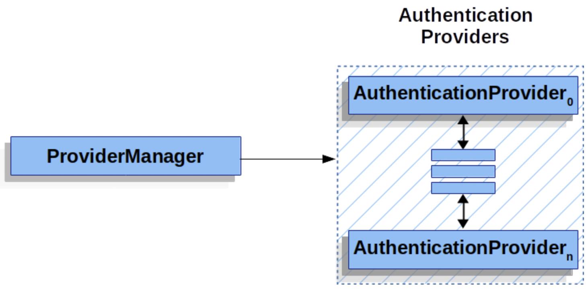
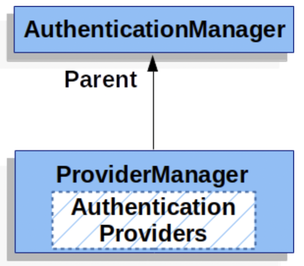
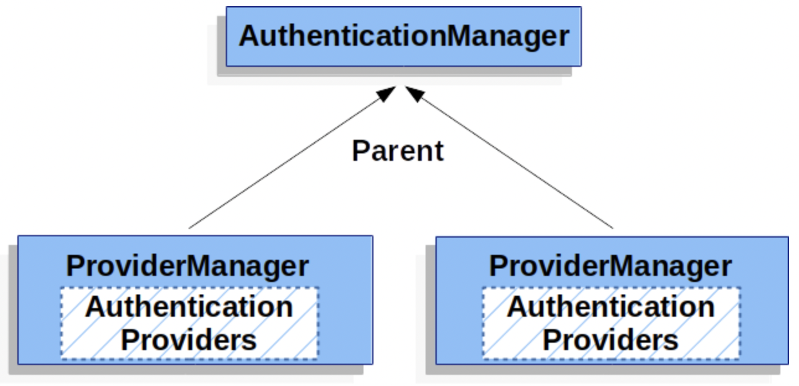

<h1>Spring Security Authentication 지원 클래스</h1>

# SecurityContext

- `SecurityContext`는 `SecurityContextHolder`에 사용되며, `Authentcation` 객체를 가진다.

# Authentication

- `Authentication` 클래스는 아래의 2개 목적으로 Spring Security에서 사용된다.

  1. `AuthenticationManager`에게 사용자가 제공한 인증을 위한 정보(credentials)들을 제공한다.  
     이 과정에서 `Authentication#isAuthenticated()`는 false를 반환한다.
  2. 현재 인증되어 있는 사용자에 대한 정보를 담는다. **현재 인증된 사용자** 에 대한 정보를 담은 `Authentication`객체는  
     `SecurityContext` 클래스로부터 받아올 수 있다.

- `Authentication` 객체는 아래의 정보들을 가진다.
  - `principal` : 사용자를 식별한다. username/password로 인증하는 경우, `UserDetails`의 인스턴스가 이 필드에 사용된다.
  - `credentials` : 보통 비밀번호를 담는다. 대다수의 경우, 인증 후 정보 유출을 방지하기 위해 이 필드는 초기화된다.
  - `authorities` : 보통 사용자가 가진 권한을 `GrantedAuthorities`객체에 담는다.  
     때로는 역할(role) 또는 권한 범위(scope)에 대한 정보도 갖는다.

# GrantedAuthority

- `GrantedAuthority`는 사용자에게 부여된 high-level 권한들을 가진다. 때로는 역할(role) 또는 범위(scope)를 가지기도 한다.

- `GrantedAuthority`객체는 `Authentication#getAuthorities()` 메소드를 통해 가져올 수 있다.  
   이 메소드는 `GrantedAuthority`객체들을 담은 `Collection` 객체를 반환한다.

- `GrantedAuthority`는 principal(사용자 식별)에 부여된 권한에 대한 정보를 가진다.  
  이 권한은 대부분 역할(role)으로, `ROLE_ADMINISTRATOR`, `ROLE_HR_SUPERVISOR` 등의 값을 가진다.  
  이 역할들은 추후에 웹 인증, HTTP 메소드 인증, 도메인 리소스 인증 등에 활용된다.  
  Spring Security의 다른 부분에서는 이 역할 권한들을 해석하며, 이들이 제공될 것이라고 예상한다.  
  username/password 방식의 인증을 사용할 때, `GrantedAuthority`객체들은 `UserDetailsService`로부터 받아올 수 있다.

- 보통 `GrantedAuthority` 객체들은 애플리케이션 전반에 걸쳐서 사용된다. 이 객체는 특정 도메인 리소스에 한정되어 있지 않다.  
  특정 리로스에 대해서만 이 객체를 사용하는 것은 메모리 초과 등의 문제를 일으킬 수 있다.

# AuthenticationManager

- `AuthenticationManager`는 Spring Security의 `Filter`들이 어떻게 작동할 것인지를 정의하는 API이다.  
  `Filter`에 의해 반환된 `Authentication`객체는 `AuthenticationManager`를 동작시킨 "컨트롤러"에 의해  
  `SecurityContextHolder`에 저장된다.(컨트롤러는 Spring Security의 Filter 등을 포함한다.)

- 만약 Spring Security의 `Filter`를 사용하지 않는다면, `AuthenticationManager`를 사용하지 않고  
  직접 `Authentication` 객체를 `SecurityContextHolder`에 넣어줄 수 있다.

- `AuthenticationManager`의 구현체는 다양하지만, 주로 `ProviderManager` 구현체가 사용된다.

# ProviderManager

- `ProviderManager`는 가장 많이 쓰이는 `AuthenticationManager`의 구현 클래스이다.
  또한 `ProviderManager`는 `AuthenticationProvider`들로 이루어진 리스트를 가진다.  
  각 `AuthenticationProvider`는 요청된 인증이 성공했는지, 실패했는지, 또는 그 단계에서는 판별할 수 없다고  
  판단했을 때에는 다른 `AuthenticationProvider`가 성공 여부를 결정할 수 있다. 만약 설정된 `AuthenticationProvider`들 중  
  인증에 대한 처리를 할 수 있는 클래스가 없다면, 인증은 `ProviderNotFoundException` 예외를 던지며 실패한다.  
  `ProviderNotFoundException`은 `AuthenticationException` 중 하나로, 해당 인증을 처리기 위해  
  `ProviderManager`가 알맞게 설정되어 있지 않았을 때 던져지는 예외 클래스이다.

- 아래 그림은 `ProviderManager`와 `AuthenticationManager`들의 관계를 나타낸 그림이다.

- 실제로 각 `AuthenticationProvider`는 특정 형식의 인증을 어떻게 처리해야 할지 알고 있다.  
   예를 들어, 하나의 `AuthenticationProvider`는 username/password 형식의 인증을 처리할 수 있는 반면에  
   다른 `AuthenticationProvider`는 SAML Assertion에 대한 인증을 수행할 수 있다.  
   이는 각 `AuthenticationProvider`가 특정 인증 방식에 대한 인증을 수행할 수 있게 해주며, 이를 통해  
   여러 가지의 인증 방식을 지원할 수 있도록 해준다. 그리고 `AuthenticationProvider`들은 하나의 `AuthenticationManager`로  
   묶여 있기에 Spring 차원에서는 한 개의 bean만 등록되는 것으로 처리된다.

- `ProviderManager`는 만약 해당 인스턴스가 가진 `AuthenticationProvider`들 중 인증을 처리할 수 있는  
  `AuthenticationProvider`가 없다면 수행될 부모 클래스인 `AuthenticationManager`를 설정할 수도 있다.  
  부모 클래스는 `AuthenticationManager`의 구현체이기만 하면 되는데, 대부분의 경우 `ProviderManager`의 인스턴스가 사용된다.

- 동일한 `AuthenticationManager`의 구현체를 부모 클래스를 두는 `ProviderManager` 인스턴스들이 다중으로 있을 수도 있다.  
  예를 들어 여러 개의 `SecurityFilterChain` 인스턴스들이 동일한 인증 방식을 사용한다면 공통적인 인증 방식을  
  부모 클래스인 `AuthenticationManager`의 구현체에 정의하면 되고, 각자 다른 인증 방식들에 대해서는  
  각각의 `ProviderManager` 인스턴스 내에 정의하면 된다.

- 기본적으로 `ProviderManager`는 성공적인 인증 요청에 의해 반환되는 `Authentication`객체의 민감한 인증 정보를 지우려고 한다.  
  이는 비밀번호와 같은 비밀 정보가 `HttpSession`에 필요 이상으로 유지되는 것을 방지한다.  
  이러한 행위는 Stateless 애플리케이션에서 성능 향상을 위해 사용자 정보를 cache화 시킬 때 문제를 발생시킬 수 있다.  
  만약 `Authentication`객체가 `UserDetails` 인스턴스와 같이 cache내의 객체와 연관되어 있을 때,  
  `ProviderManager`가 해당 객체를 cache에서 지워버리려 하기에 더 이상 cache내의 정보로 인증을 진행할 수 없을 수도 있다.  
  따라서 cache를 사용할 때에는 이에 항상 유념해야 한다. 이 방식을 `ProviderManager`의 eraseCredentialsAfterAuthentication  
  속성을 설정하여 막을 수도 있다.

