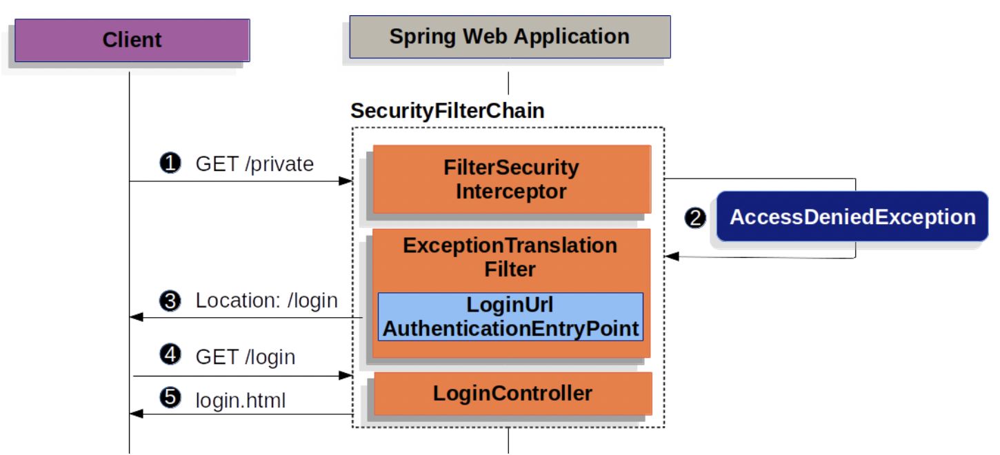
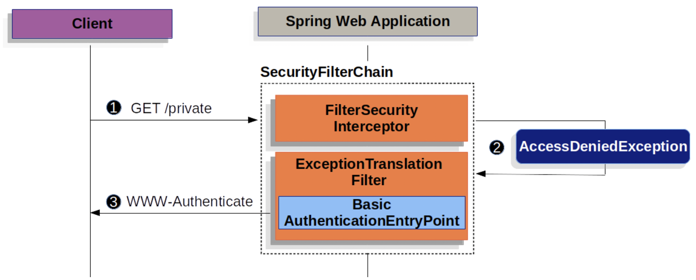
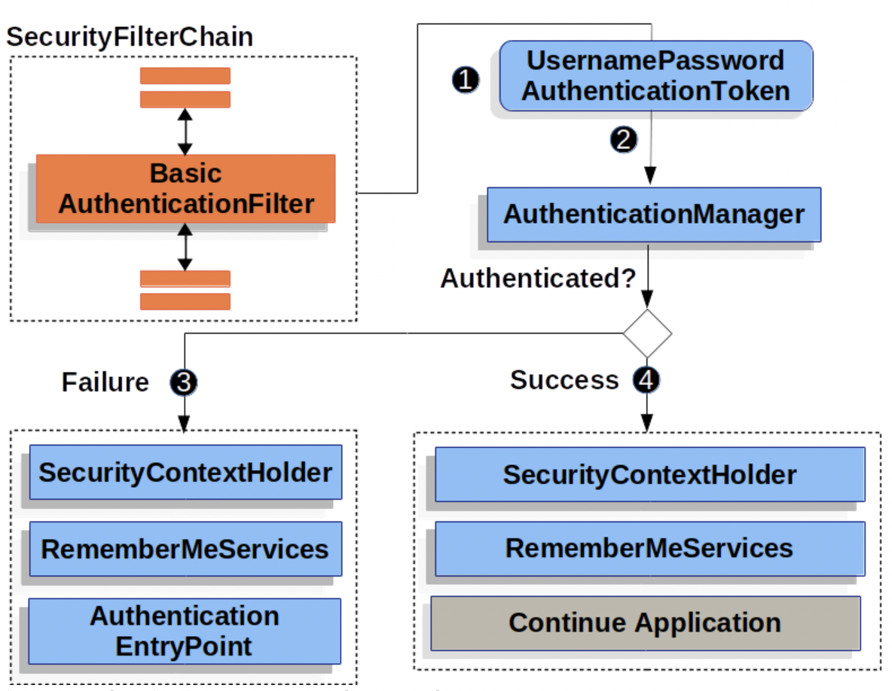
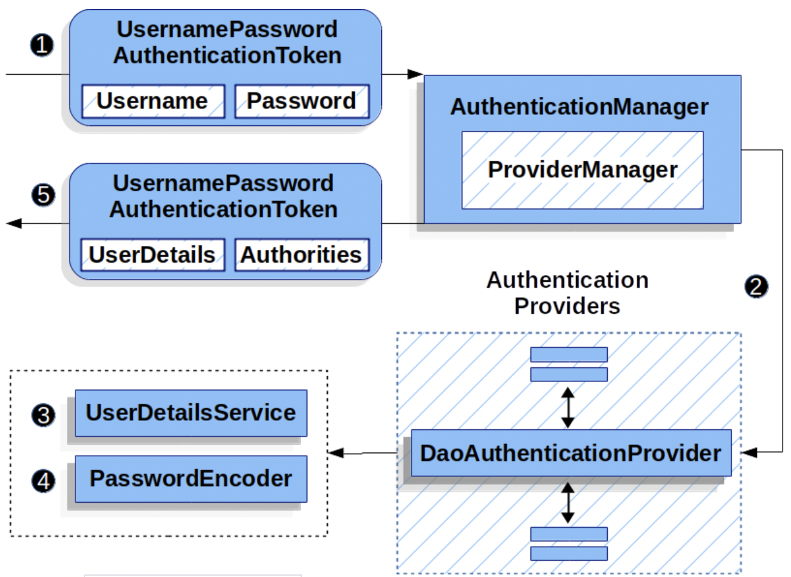

<h1>Username/Password 인증</h1>

- 사용자에 대한 인증을 수행하는 가장 보편적인 방법 중 하나는 username과 password를 검증하는 것이다.  
  Spring Security는 이 방식을 통한 인증을 지원한다.

<h3>Username, Password 읽기</h3>

- Spring Security는 `HttpServletRequest`로부터 username, password를 읽기 위해 아래의 방식들을 제공한다.
  - Form Login
  - Basic Authentication
  - Digest Authentication

<h3>Storage 메커니즘</h3>

- 위에서 Spring Security가 제공하는 방식들은 아래의 저장소 메커니즘을 사용할 수 있다.
  - Simple Storage with `In-Memory Authentication`
  - Relational Databases with `JDBC Authentication`
  - Custom data stores with `UserDetailsService`
  - LDAP storage with `LDAP Authentication`

<hr/>

# Form Login

- Spring Security는 html form을 통한 username, password 인증 방식을 지원한다.

- 우선 아래 그림을 통해 form으로 진행되는 username/password 방식이 Spring Security에서 어떻게 처리되는지 살펴보자.



- 위 그림의 프로세스는 `SecurityFilterChain`이 중심이 되어 작동한다.

  - (1) : 사용자가 `/private` 엔드포인트에 대해 인증이 되어있지 않은 요청을 수행한다.
  - (2) : Spring Security의 `FilterSecurityInterceptor`가 `AccessDeniedException`을 발생시켜 해당 요청이 "denied"됨을 알린다.
  - (3) : 사용자가 인증이 되어있지 않기에, `ExceptionTranslationFilter`는 사용자를 `AuthenticationEntryPoint`에 설정된 페이지로  
    이동시켜 인증을 진행하도록 한다. 보통 이 때 사용되는 `AuthenticationEntryPoint`는 `LoginUrlAuthenticationEntryPoint`의 인스턴스이다.
  - (4) : 브라우저는 화면을 로그인 페이지로 이동시킨다.
  - (5) : login.html을 반환한다. (**프로그램은 무조건 login 페이지를 렌더링 하도록 해야 한다.**)

- 이후에 username과 password가 제공되면, `UsernamePasswordAuthenticationFilter`가 username과 password에 대한  
  인증 작업을 시작한다. `UsernamePasswordAuthenticationFilter`는 `AbstractAuthenticationProcessingFilter`를 상속한다.  
  이후 과정에 대한 설명은 <a href="https://github.com/sangwoo-98/Study/blob/master/Spring%20Security/3-2%20More%20classes%20for%20authentication.md#AbstractAuthenticationProcessingFilter">링크</a>에서 볼 수 있다.

- Spring Security의 form login은 기본적으로 작동되도록 설정되어 있다.  
  하지만 만약 servlet 바탕의 설정 클래스가 추가된다면, form login을 무조건 명시적으로 지정해야 한다.  
  아래는 최소한의 Java Configuration 코드이다.

```java
protected void configure(HttpSecurity http) {
    http
        //..
        .formLogin(withDefaults());
}
```

- 위 설정대로는 Spring Security는 기본적인 login 페이지를 띄울 것이다.  
  대부분의 프로덕트 레벨 애플리케이션은 이 폼을 따로 작성한다.  
  커스텀으로 만들어진 폼을 반환하는 코드는 아래와 같다.

```java
protected void configure(HttpSecurity http) throws Exception {
    http
        //..
        .formLogin(form -> form
                    .loginPage("/login")
                    .permitAll());
}
```

- 위와 같이 login 페이지가 Spring Security Configuration 클래스를 통해 지정되면, 개발자는 해당 페이지를  
  렌더링할 책임이 있다.

- 아래는 Thymeleaf STE를 사용한 간단한 로그인 페이지의 예시이다.

```html
<!DOCTYPE html>
<html xmlns="http://www.w3.org/1999/xhtml" xmlns:th="https://www.thymeleaf.org">
  <head>
    <title>Please Log In</title>
  </head>
  <body>
    <h1>Please Log In</h1>
    <div th:if="${param.error}">Invalid username and password.</div>
    <div th:if="${param.logout}">You have been logged out.</div>
    <form th:action="@{/login}" method="post">
      <div>
        <input type="text" name="username" placeholder="Username" />
      </div>
      <div>
        <input type="password" name="password" placeholder="Password" />
      </div>
      <input type="submit" value="Log in" />
    </form>
  </body>
</html>
```

- 위 로그인 폼에서 눈여겨 봐야할 것들은 아래와 같다.
  - Form은 `POST` 방식으로 `/login`에 요청을 보내야 한다.
  - Form은 Thymeleaf에는 기본적으로 포함된 CSRF Token을 가져야 한다.
  - Form은 username이라는 파라미터로 해당 필드가 username임을 알려줘야 한다.
  - Form은 password라는 파라미터로 해당 필드가 password임을 알려줘야 한다.
  - 만약 HTTP Parameter가 잘못 설정되면, 사용자는 올바른 username, password를 제공하지 않은 것으로 처리된다.
  - 만약 HTTP Paramter에 logout이 있다면, 해당 사용자가 정상적으로 로그아웃 처리되었다고 인식한다.
  <hr/>

# Basic Authentication

- Spring Security에서 HTTP Basic Authentication이 어떻게 작동하는지를 알아보자.  
  아래 그림은 만약 인증에 필요한 정보가 제공되지 않았다면 `WWW-Authenticate` 헤더가  
  클라이언트에게 반환되는 것을 볼 수 있다.



- 위 그림에 대한 단계별 설명은 아래와 같다.

  - (1) : 사용자가 `/private` 엔드포인트에 대해 인증이 되지 않은 상태로 요청을 보낸다.
  - (2) : Spring Security의 `FilterSecurityInterceptor`가 `AccessDeniedException`을 발생시켜 해당 요청이 인증되지 않음을 알린다.
  - (3) : 사용자가 인증이 되어있지 않기에, 설정된 `AuthenticationEntryPoint`(인스턴스화 된 객체는 `BasicAuthenticationEntryPoint`)가  
    `WWW-Authenticate` 헤더를 반환한다.

- 클라이언트가 `WWW-Authenticate` 헤더를 응답으로 받으면, 인증이 되어 있지 않다는 것을 인지하고 인증을 위해 다시 시도해야 한다.  
  아래는 클라이언트가 인증 정보를 보냈을 때 발생되는 과정에 대한 그림이다.



- (1) 사용자가 username,password를 보내면 `BasicAuthenticaionFilter`는 `Authentication`의 구현체 중 하나인  
  `UsernamePasswordAuthenticationToken`을 `HttpServletRequest`의 username, password를 가지고 생성한다.
- (2) : `AuthenticationManager`에 `UsernamePasswordAuthenticationToken`이 인증 절차를 밟기 위해 전달된다.  
  이 때, 어떤 `AuthenticationManager`가 사용될지는 사용자 정보가 어떻게 저장되느냐에 따라 달라진다.
- (3) : 인증이 실패하면 아래의 작업들이 수행된다.
  - `SecurityContextHolder`가 메모리 초기화된다.
  - `RememberMeServices#loginFail()`이 호출된다. 만약 rememberme가 설정되어 있지 않다면 이 단계는 건너뛴다.
  - `AuthenticationEntryPoint`가 다시 클라이언트에게 `WWW-Authenticate` 헤더를 보내기 위해 호출된다.
- (4) : 인증이 성공하면 아래의 작업들이 수행된다.
  - `Authentication`객체가 `SecurityContextHolder`에 "set" 된다.
  - `RememberMeServices#loginSuccess()`가 호출된다. 만약 rememberme가 설정되어 있지 않다면 이 단계는 건너뛴다.
  - `BasicAuthenticationFilter`가 이후 애플리케이션의 작업을 수행하도록 `FilterChain#doFilter(request, response)`를 호출한다.

* Spring Security의 HTTP Basic Authentication은 기본적으로 활성화되어 있다.  
  하지만 Form Login과 마찬가지로 servlet 바탕의 설정이 하나라도 추가된다면, 개발자는 명시적으로 설정해야 한다.  
  아래는 해당 설정을 활성화하기 위한 최소한의 코드이다.

```java
protected void configure(HttpSecurity http) {
    http
        //..
        .httpBasic(withDefaults());
}
```

<hr/>

# UserDetailsService

- `UserDetailsService`는 `DaoAuthenticationProvider`가 인증에 필요한 username, password 등의 정보를 참조할 때 사용된다.  
  Spring Security는 In-Memory 방식과 JDBC 방식으로 구현된 `UserDetailsService`의 구현체를 제공한다.

- 개발자는 직접 만든 `UserDetailsService`를 bean으로 등록할 수도 있다.  
  아래 코드는 `CustomUserDetailsService`가 `UserDetailsService`의 구현체라는 가정하에 작성된 코드이다.

```java
@Bean
CustomUserDetailsService customUserDetailsService() {
    return new CustomUserDetailsService();
}
```

<hr/>

# UserDetails

- `UserDetails`는 `UserDetailsService`로부터 가져올 수 있다. `DaoAuthenticationProvider`는 `UserDetails`를 검증하고,  
  해당 `UserDetails`객체가 설정된 `UserDetailsService` 로부터 받아왔다는 정보를 담은 `Authentication` 객체를 반환한다.

<hr/>

# PasswordEncoder

- Spring Security의 servlet은 `PasswordEncoder`를 통해 비밀번호를 안전하게 저장하도록 한다.  
  `PasswordEncoder`의 특정 구현체를 사용하는 방식은 `PasswordEncoder` bean을 등록하면 가능하다.

<hr/>

# DaoAuthenticationProvider

- `DaoAuthenticationProvider`는 `AuthenticationProvider`의 구현체 중 하나로, username과 password를  
  인증하기 위해 `UserDetailsService`와 `PasswordEncoder`를 사용한다.

- 아래는 Spring Security에서 `DaoAuthenticationProvider`가 작동하는 방식을 나타낸 그림이다.

- 

- 각 단계에 대한 설명은 아래와 같다.
- (1) : 인증 `Filter`가 username, password를 읽어와 `UsernamePasswordAuthenticationToken`을 생성해  
   `ProviderManager`로 전달한다.
- (2) : 호출된 `ProviderManager`는 `AuthenticationProvider` 중 `DaoAuthenticationProvider`를 이용해 검증을 진행하게 된다.
- (3) : `DaoAuthenticationProvider`가 `UserDetailsService`로부터 `UserDetails`를 받아온다.
- (4) : `DaoAuthenticationProvider`가 `PasswordEncoder`를 사용하여 `UserDetails`에 있는 password를 검증한다.
- (5) : 만약 인증이 성공적이면, 설정된 `UserDetailsService`가 `UserDetails`를 통해 `Authentication`의  
  구현체인 `UsernamePasswordAuthenticationToken`을 반환한다.  
  최종적으로, 인증 `Filter`에 의해 위에서 반환된 `UsernamePasswordAuthenticationToken`이  
  `SecurityContextHolder`에 "set" 된다.

<hr/>

# In-Memory Authentication

- Spring Security의 `InMemoryUserDetailsManager`는 `UserDetailsService`를 구현하여 메모리에서  
  가져온 username, password 기반의 인증을 지원한다. `InMemoryUserDetailsManager`는 또한  
  `UserDetailsManager`를 구현하여 `UserDetails` 객체의 관리까지 지원한다.  
  Spring Security가 username/password 기반의 인증을 허용하도록 설정되어 있을 때  
  `UserDetails` 기반의 인증 방식이 사용된다.

- 아래 예시에서는 bcrypt 방식으로 인코딩 된 `password`라는 password를 저장한다.  
  인코딩 결과 : `{bcrypt}$2a$10$GRLdNijSQMUvl/au9ofL.eDwmoohzzS7.rmNSJZ.0FxO/BTk76klW`  
  아래 예시는 `InMemoryUserDetailsManager`의 설정 예시이다.

```java
@Bean
public UserDetailsService users() {
  UserDetails user = User.builder()
    .username("user")
    .password("{bcrypt}$2a$10$GRLdNijSQMUvl/au9ofL.eDwmoohzzS7.rmNSJZ.0FxO/BTk76klW")
    .roles("USER")
    .build();
  UserDetails admin = User.builder()
        .username("admin")
        .password("{bcrypt}$2a$10$GRLdNijSQMUvl/au9ofL.eDwmoohzzS7.rmNSJZ.0FxO/BTk76klW")
        .roles("USER", "ADMIN")
        .build();

  return new InMemoryUserDetailsManager(user, admin);
}
```

- 위 방식은 password를 암호화한 상태로 저장하지만, 아직 추가적으로 설정해야할 것들이 많다.

- 아래 예시에서는 메모리에 저장된 암호가 암호화되었다는 것을 보장하기 위해 `User#withDefaultPasswordEncoder()`를 사용한다.  
  하지만 이 작업은 소스 코드를 decompile하여 암호를 탈취하는 것에 대한 보안적인 대책이 없다.  
  따라서 `User#withDefaultPasswordEncoder()`는 프로덕트 용으로는 사용하면 안된다.

```java
@Bean
public UserDetailsService users() {
    // The builder will ensure the passwords are encoded before saving in memory
    UserBuilder users = User.withDefaultPasswordEncoder();
    UserDetails user = users
        .username("user")
        .password("password")
        .roles("USER")
        .build();
    UserDetails admin = users
        .username("admin")
        .password("password")
        .roles("USER", "ADMIN")
        .build();
    return new InMemoryUserDetailsManager(user, admin);
}
```

# JDBC Authentication
