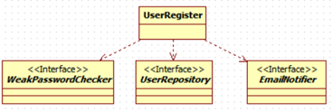

<h1>대역</h1>

<h2>대역의 필요성</h2>

* 테스트를 작성하다 보면 외부 요인이 필요한 시점이 있다. 아래는 외부 요인이 테스트에 관여하는 주요 예시이다.
  * 테스트 대상에서 파일 시스템을 사용하는 경우
  * 테스트 대상에서 DB로부터 데이터를 조회하거나 데이터를 추가하는 경우
  * 테스트 대상에서 외부의 HTTP 서버와 통신하는 경우

* 테스트 대상이 이런 외부 요인에 의존하면 테스트를 작성하고 실행하기 어려워진다. 테스트 대상 코드에서 사용하는   
  외부 API 서버가 일시적으로 장애가 나면 테스트를 원활하게 수행할 수 없다. 내부에서 사용하는 DB라도 상황에 맞게   
  데이터를 구성하는 것이 항상 가능한 것은 아니다.

* 외부 API를 사용하는 자동이체 서비스의 경우, 외부 업체가 제공하는 API를 이용하여 카드번호의 유효성을 검증한다.   
  이 기능을 테스트하려면 정상 카드번호, 도난 카드번호, 만료일이 지난 카드 번호가 필요하기 때문에 외부 업체에서   
  상황별로 테스트할 수 있는 카드번호를 받아와야 한다.

* TDD는 `테스트 작성 --> 통과시킬 만큼 구현 --> 리팩토링`의 과정을 짧은 흐름으로 반복해야 하는데 외부 업체에서   
  상황별 카드번호를 제공하지 않으면 테스트를 진행할 수 없게 된다.

* 이처럼 외부 요인은 테스트 작성을 어렵게 만들 뿐만 아니라 테스트 결과도 예측할 수 없게 만든다.   
  실제 예시 코드로 살펴보자.
```java
public class AutoDebitRegister {

    private CardNumberValidator validator;
    private AutoDebitInfoRepository repository;

    public AutoDebitRegister(CardNumberValidator validator, AutoDebitInfoRepository repository) {
        this.validator = validator;
        this.repository = repository;
    }

    public RegisterResult register(AutoDebitRequest request) {
        CardValidity validity = validator.validate(request.getCardNumber());
        if(validity != CardValidity.VALID) {
            return RegisterResult.error(validity);
        }
        AutoDebitInfo info = repository.findOne(request.getUserId());
        if(info != null) {
            info.changeCardNumber(request.getCardNumber());
        } else {
            AutoDebitInfo newInfo = new AutoDebitInfo(request.getUserId(), request.getCardNumber(),
                LocalDateTime.now());
            repository.save(newInfo);
        }
        return RegisterResult.success();
    }
}
```

* `AutoDebitRegister` 클래스에서 사용하는 `CardNumberValidator` 클래스는 아래와 같다.
```java
public class CardNumberValidator {

    public CardValidity validate(String cardNumber) {
        HttpClient httpClient = HttpClient.newHttpClient();
        HttpRequest request = HttpRequest.newBuilder()
            .uri(URI.create("SOME URL"))
            .header("Content-Type", "text/plain")
            .POST(BodyPublishers.ofString(cardNumber))
            .build();
        
        try {
            HttpResponse<String> response = 
                httpClient.send(request, BodyHandlers.toString());
            switch(response.body()) {
                case "ok": return CardValidity.VALID;
                case "bad": return CardValidity.INVALID;
                case "expired": return CardValidity.EXPIRED;
                case "theft" : return CardValidity.THEFT;
                default: return CardValidity.UNKNOWN;
            }
        } catch(IOException | InterruptedException exception) {
            return CardValidity.ERROR;
        }
    }
}
```

* 이제 `AutoDebitRegister`를 테스트하는 코드를 작성해보자.
```java
public class AutoDebitRegisterTest {
    private AutoDebitRegister register;

    @BeforeEach
    void setUp() {
        CardNumberValidator validator = new CardNumberValidator();
        AutoDebitInfoRepository repository = new JpaAutoDebitInfoRepository();
        register = new AutoDebitRegister(validator, repository);
    }

    @Test
    void validCard() {
        // 업체에서 받은 테스트용 유효한 카드번호 사용
        AudoDebitRequest request = new AutoDebitRequest("user1", "1234123412341234");
        RegisterResult result = this.register.register(request);
        assertEquals(CardValidity.VALID, result.getValidity());
    }

    @Test
    void theftCard() {
        // 업체에서 받은 도난 테스트용 카드 번호
        AutoDebitRequest request = new AutoDebitRequest("user1", "1231231231231231");
        RegisterResult result = this.register.register(request);
        assertEquals(CardValidity.THEFT, result.getValidity());
    }
}
```

* 위 코드에서 `validCard()` 테스트를 통과시키려면 외부 업체에서 테스트 목적의 유효한 카드 번호를 받아야 한다. 만약 이 카드번호가   
  한달 뒤에 만료되면 `validCard()` 테스트는 한달 뒤부터 실패한다. 비슷하게 테스트 용도의 도난 카드 정보를 외부 업체에서 삭제하면   
  `theftCard()` 테스트도 실패하게 될 것이다.

* 이렇게 테스트 대상에서 의존하는 요인 때문에 테스트가 어려울 때는 `대역`을 써서 테스트를 진행할 수 있다.   
  난이도가 높은 액션이 필요할 때 배우를 대신해서 연기하는 스턴트맨처럼 테스트에서는 외부 요인으로 인해 테스트가 어려울 때   
  외부 요인을 대신하는 대역이 외부 요인을 대신해서 테스트에 참여한다.
<hr/>

<h2>대역을 이용한 테스트</h2>

* 대역을 이용하여 `AutoDebitRegister`를 테스트하는 코드를 다시 작성해보자.   
  먼저 `CardNumberValidator`를 대신할 대역 클래스를 작성해보자.
```java
@Setter
public class StubCardNumberValidator extends CardNumberValidator {
    private String invalidNo;

    @Override
    public CardValidity validate(String cardNumber) {
        if(invalidNo != null && invalidNo.equals(cardNumber)) {
            return CardValidity.INVALID;
        }
        return CardValidity.VALID;
    }
}
```

* `StubCardNumberValidator`는 실제 카드번호 검증 기능을 구현하지 않는다. 대신 단순 구현으로 실제 구현을 대체한다.   
  `validate()` 메소드는 invalidNo 필드와 동일한 카드번호면 결과로 INVALID를, 다르면 VALID를 반환한다.   
  위 클래스를 이용해서 `AudoDebitRegister`를 테스트하는 코드를 작성해보자.
```java
public class AutoDebitRegister_Stub_Test {
    private AutoDebitRegister register;
    private StubCardNumberValidator stubValidator;
    private StubAutoDebitInfoRepository stubRepository;

    @BeforeEach
    void setUp() {
        stubValidator = new StubCardNumberValidator();
        stubRepository = new StubAutoDebitInfoRepository();
        register = new AutoDebitRegister(stubValidator, stubRepository);
    }

    @Test
    void invalidCard() {
        stubValidator.setInvalidNo("111122223333");

        AutoDebitRequest request = new AutoDebitRequest("user1", "111122223333");
        RegisterResult result = register.register(request);

        assertEquals(CardValidity.INVALID, result);
    }
}
```

* 위 코드는 `#StubCardNumberValidator#invalidNo`를 111122223333로 지정했고, 테스트할 때에도 동일한 값을 이용했으므로   
  결론적으로 테스트는 통과한다. 추가로 도난 카드에 대한 테스트를 진행하고 싶다고 하자.
```java
@Setter
public class StubCardNumberValidator extends CardNumberValidator {
    private String invalidNo;
    private String theftNo;

    @Override
    public CardValidity validate(String cardNumber) {
        if(invalidNo != null && invalidNo.equals(cardNumber)) {
            return CardValidity.INVALID;
        }
        if(theftNo != null && thefNo.equals(cardNumber)) {
            return CardValidity.THEFT;
        }
        return CardValidity.VALID;
    }
}
```

* 도난 카드번호를 처리하기 위한 대역을 구현했으니 이제 테스트 메소드를 작성해보자.
```java
public class AutoDebitRegister_Stub_Test {
    //..

    @Test
    void theftCard() {
        stubValidator.setTheftNo("1234123412341234");

        AutoDebitRequest request = new AutoDebitRequest("user1", "1234123412341234");
        RegisterResult result = register.register(request);

        assertEquals(CardValidity.THEFT, result);
    }
}
```

* DB 연동 코드도 대역을 사용하기에 적합하다.   
  예를 들어 자동이체 정보의 DB연동을 처리하는 Repository interface가 아래와 같다고 가정하자.
```java
public interface AutoDebitInfoRepository {
    void save(AutoDebitInfo info);
    AutoDebitInfo findOne(String userId);
}
```

* 위의 코드를 보면 `AutoDebitRegister`는 `AutoDebitInfoRepository`를 사용해서 자동이체 정보를 저장했다.   
  대역을 사용하면 DB없이 `AutoDebitRegister`를 테스트할 수 있다.   
  `AutoDebitInfoRepository`의 대역을 아래와 같이 구현해보자.
```java
public class MemoryAutoDebitInfoRepository implements AutoDebitInfoRepository {

    private Map<String, AutoDebitInfo> infos = new HashMap<>();

    @Override
    public void save(AutoDebitInfo info) {
        infos.put(info.getUserId(), info);
    }

    @Override
    public AutoDebitInfo findOne(String userId) {
        return infos.get(userId);
    }
}
```

* 위 클래스는 DB 대신 맵을 이용해서 자동이체 정보를 저장한다. 메모리에만 데이터가 저장되므로 DB와 같은 영속성을   
  제공하지는 않지만, 테스트에 사용할 만큼의 기능은 제공한다. 아래는 위 클래스를 이용하여 작성한 테스트 코드이다.
```java
public class AutoDebitRegister_Fake_Test {

    private AutoDebitRegister register;
    private StubCardNumberValidator cardNumberValidator;
    private MemoryAutoDebitInfoRepository repository;

    @BeforeEach
    void setUp() {
        cardNumberValidator = new StubCardNumberValidator();
        repository = new MemoryAutoDebitInfoRepository();
        register = new AutoDebitRegister(cardNumberValidator, repository);
    }

    @Test
    void alreadyRegister_InfoUpdated() {
        repository.save(new AutoDebitInfo("user1", "1111222233334444", LocalDateTime.now()));

        AutoDebitRequest request = new AutoDebitRequest("user1", "123456789012");
        RegisterResult result = this.register.register(request);

        AutoDebitInfo saved = repository.findOne("user1");
        assertEquals("123456789012", saved.getCardNumber());
    }

    @Test
    void notRegistered_newInfoRegistered() {
        AutoDebitRequest request = new AutoDebitRequest("user1", "1234123412341234");
        RegisterResult result = this.register.register(request);

        AutoDebitInfo saved = repository.findOne("user1");
        assertEquals("1234123412341234", saved.getCardNumber());
    }
}
```

* 짚고 넘어갈 것은 `notRegistered_newInfoRegistered()`에서 "user1"이 아이디인 객체가 `MemoryAutoDebitInfoRepository`에   
  없는 이유는 테스트가 실행될 때 마다 `@BeforeEach`가 적용된 `setUp()`에 의해 매번 새로운 인스턴스가 생기기 때문이다.
<hr/>

<h2>대역을 사용한 외부 상황 흉내와 결과 검증</h2>

* 앞서 대역을 사용한 테스트에서 주목할 점은 아래 두 가지 없이 `AutoDebitRegister`에 대한 테스트를 수행한 것이다.
  * 외부 카드 정보 API 연동
  * 자동이체 정보를 저장한 DB

* 대역을 사용한 코드들의 공통점은 외부의 상황을 흉내 낸다는 것이다.
  * `StubCardNumberValidator` : 카드 정보 API를 대신해서 유효한 카드번호, 도난 카드번호와 같은 상황을 흉내낸다.
  * `MemoryAutoDebitInfoRepository` : 특정 사용자에 대한 자동이체 정보가 이미 등록되어있거나 등록되지 않은 상황을 흉내낸다.
<hr/>

<h2>대역의 종류</h2>

* 구현에 따라 대역의 아래 표와 같이 구분할 수 있다.
<table>
    <tr>
        <td>대역 종류</td>
        <td>설명</td>
    </tr>
    <tr>
        <td>Stub</td>
        <td>구현을 단순한 것으로 대체한다. 테스트에 맞게 단순히 원하는 동작을 수행한다.</td>
    </tr>
    <tr>
        <td>Fake</td>
        <td>제품에는 적합하지 않지만, 실제 동작하는 구현을 제공한다. DB 대신에 메모리를 이용해서 구현하는 등의 방법을 사용한다.</td>
    </tr>
    <tr>
        <td>Spy</td>
        <td>호출된 내역을 기록한다. 기록된 내용은 테스트 결과를 검증할 때 사용한다. Stub이기도 하다.</td>
    </tr>
    <tr>
        <td>Mock</td>
        <td>기대한 대로 상호작용하는지 행위를 검증한다. 기대한 대로 동작하지 않으면 예외를 발생시킬 수 있다. Stub이자 Spy도 될 수 있다.</td>
    </tr>
</table>

* 예시를 이용하여 대역을 살펴보자. 아래는 간단한 회원 가입 기능에 대한 클래스 다이어그램이다.



* 각 타입은 아래의 역할을 수행한다.
  * `UserRegister` : 회원 가입에 대한 핵심 로직을 수행한다.
  * `WeakPasswordChecker` : 암호 강도가 약한지 검사한다.
  * `UserRepository` : 회원 정보를 저장하고 조회하는 기능을 제공한다.
  * `EmailNotifier` : 이메일 발송 기능을 제공한다.

<h3>약한 암호 확인 기능에 Stub 사용</h3>

* 시작할 테스트 코드는 아래와 같다.
```java
public class UserRegisterTest {

    private UserRegister userRegister;
    private StubWeakPasswordChecker stubPasswordChecker = new StubWeakPasswordChecker();

    @BeforeEach
    void setUp() {
        userRegister = new UserRegister(stubPasswordChecker);
    }

    @DisplayName("Weak password --> fail")
    @Test
    void weakPassword() {
        stubPasswordChecker.setWeak(true);  // 암호가 약하다고 응답하도록 설정한다.

        assertThrows(WeakPasswordException.class,
            () -> userRegister.register("id", "pw", "email")
        );
    }
}
```

* 위 코드에서 `stubPasswordChecker.setWeak(true)`를 한 이유는 아직 구현 전이기 때문이다.   
  컴파일 에러를 하나씩 없애보자.
```java
public interface WeakPasswordChecker {}

public class WeakPasswordException extends RuntimeException {}

public class StubWeakPasswordChecker implements WeakPasswordChecker {
    private boolean weak;
    public void setWeak(boolean weak){ this.weak = weak;}
}

public class UserRegister {
    private WeakPasswordChecker passwordChecker;
    
    public UserRegister(WeakPasswordChecker passwordChecker) {
        this.passwordChecker = passwordChecker;
    }

    public void register(String id, String pw, String email) {
        // Before implementation.
    }
}
```

* 이 상태로 테스트 메소드를 수행해보면, `WeakPasswordExeption`이 발생하지 않기에 실패한다.   
  이 테스트를 통과시키는 가장 쉬운 방법은 `UserRegister#register()`가 예외를 던지게끔 수정하면 된다.
```java
public class UserRegister {
    //..
    public void register(String id, String pw, String email) {
        throw new WeakPasswordException();
    }
}
```

* 구현을 좀 더 일반화해보자. 약한 암호인 경우에만 예외가 발생해야 하므로 약한 암호인지 검사를 한 후에 예외를 발생시키면 된다.
```java
public class UserRegister {

    private WeakPasswordChecker passwordChecker;

    // Constructor

    public void register(String id, String pass, String email) {
        if(passwordChecker.checkPasswordWeak(pw)) {
            throw new WeakPasswordException();
        }
    }
}
```

* 또 다시 컴파일 에러를 없애기 위해 아래처럼 코드를 추가하자.
```java
public interface WeakPasswordChecker {
    boolean checkPasswordWeak(String pw);
}
```

* 위 메소드의 추가로 `StubWeakPasswordChecker`도 컴파일 에러가 난다. 아래와 같이 수정하자.
```java
public class StubWeakPasswordChecker implements WeakPasswordChecker {
    private boolean weak;

    public void setWeak(boolean weak) {this.weak = weak;}

    @Override
    public boolean checkPasswordWeak(String pw) { return weak;}
}
```

* 이제 테스트를 통과할 수 있게 되었다. 대역은 테스트를 위해 필요한 값만 제공하면 되었고, 이를 위해 Stub 대역을 사용했다.

<h3>Repository를 가짜 구현으로 사용</h3>

* 테스트로 동일 ID를 가진 회원이 존재할 경우 예외를 발생시키도록 해보자. 상황을 주는 방법을 고려해보자.   
  쉬운 방법은 repository에 사용자를 추가하는 것이다.
```java
public class UserRegisterTest {
    private UserRegister userRegister;
    private StubWeakPasswordCehcker stubPasswordChecker = new StubWeakPasswordChecker();
    private MemoryUserRepository fakeRepository = new MemoryUserRepository();

    @BeforeEach
    void setUp() {
        userRegister = new UserRegister(stubPasswordChecker, fakeRepository);
    }

    //..

    @DisplayName("Duplicated ID --> Fail")
    @Test
    void duplicatedId() {
        
        // 이미 같은 ID가 존재하는 상황을 만든다.
        fakeRepository.save(new User("id", "pw1", "email@email.com"));
        assertThrows(DupIdException.class,
            () -> {userRegister.register("id", "pw2", "email");
            })
    }
}
```

* 이전과 마찬가지로 컴파일 에러를 없애보자.
```java
public class User {
    private String id;
    private String password;
    private String email;

    public User(String id, String password, String email) {
        this.id = id;
        this.password = password;
        this.email = email;
    }

    public String getId() {return id;}
    public String getEmail() {return email;}
}

public interface UserRepository { void save(User user);}

public class MemoryUserRepository implements UserRepository {
    private Map<String, User> users = new HashMap<>();

    @Override
    public void save(User user) {
        users.put(user.getId(), user);
    }
}

public class UserRegister {
    private WeakPasswordChecker passwordChecker;
    private UserRepository userRepository;

    public UserRegister(WeakPasswordChecker passwordChecker, UserRepository userRepository) {
        this.passwordChecker = passwordChecker;
        this.userRepository = userRepository;
    }
}

public class DupIdException extends RuntimeException {}
```

* 다음으로 테스트를 통과시키기 위해 단순히 예외를 발생시키는 코드를 추가하자.
```java
public class UserRegister {
    //..

    public void register(String id, String pw, String email) {
        if(passwordChecker.checkPassword(pw)) {
            throw new WeakPasswordException();
        }
        throw new DupIdException();
    }
}
```

* 이제 구현을 좀 더 일반화해보자.
```java
public class UserRegister {

    //..

    public void register(String id, String pw, String email) {
        if(passwordChecker.checkPassword(pw)) throw new WeakPasswordException();
        User user = userRepository.findById(id);
        if(user != null) throw new DupIdException();
    }
}
```

* `UserRepository#findById()`를 추가했으므로 컴파일 에러를 없애기 위해 각각 추가해주자.
```java
public interface UserRepository {
    void save(User user);
    User findById(String id);
}

public class MemoryUserRepository implements UserRepository {
    //..

    @Override
    public User findById(String id) {
        return users.get(id);
    }
}
```

* 이제 중복 아이디가 존재하지 않을 경우 회원 가입에 성공하는 테스트 메소드를 작성해보자.
```java
@Test
void noDupId_RegisterSuccess() {
    userRegister.register("id", "pw", "email");

    User savedUser = fakeRepository.findById("id");
    assertEquals("id", savedUser.getId());
    assertEquals("email", savedUser.getEmail());
}
```

* 위 코드는 NPE가 발생한다. `UserRegister#register()`에 저장하는 코드가 없기 때문이다. 간단히 해결해보자.
```java
public class UserRegister {

    //..

    public void register(String id, String pw, String email) {
        if(passwordChecker.checkPasswordWeak(pw)) throw new WeakPasswordException();
        User user = userRepository.findById(id);
        if(user != null) throw new DupIdException();
        userRepository.save(new User(id, pw, email));
    }
}
```

<h3>이메일 발송 여부를 확인하기 위해 Spy 사용하기</h3>

* 회원 가입에 성공하면 이메일로 회원 가입 안내 메일을 발송한다고 하자.   
  이를 검증하기 위한 테스트 코드의 골격은 다음과 같다.
```java
// 실행
userRegister.register("id", "pw", "email@domain.com");

// 결과
// email@domain.com으로 이메일 발송을 요청했는지 확인
```

* 이메일 발송 여부를 확인하는 방법 중 하나는 `UserRegister`가 `EmailNotifier`의 메일 발송 기능을 사용할 때, 이메일 주소로   
  email@domain.com을 사용했는지 확인하는 것이다. 이런 용도로 사용할 수 있는 것이 Spy 대역이다.   
  `EmailNotifier`의 스파이 대역을 이용한 테스트 코드를 만들어보자.
```java
public class SpyEmailNotifier implements EmailNotifier {
    private boolean called;
    private String email;

    public boolean isCalled() { return called;}

    public String getEmail() {return email;}
}

public interface EmailNotifier {}
```

* 이제 Spy 대역을 이용해서 메일 발송 여부를 확인하는 테스트를 작성하자.
```java
public class UserRegisterTest {
    private UserRegister userRegister;
    private StubWeakPasswordChecker stubPasswordChecker = new StubWeakPasswordChecker();
    private MemoryUserRepository fakeRepository = new MemoryUserRepository();
    private SpyEmailNotifier spyEmailNotifier = new SpyEmailNotifier();

    @BeforeEach
    void setUp() {
        userRegister = new UserRegister(stubPasswordChecker, fakeRepository, spyEmailNotifier);
    }

    //..

    @DisplayName("Register and email is sent.")
    @Test
    void registerThenSendEmail() {
        userRegister.register("id", "pw", "email@email.com");

        assertTrue(spyEmailNotifier.isCalled());
        assertEquals("email@email.com", spyEmailNotifier.getEmail());
    }
}
```

* `UserRegister`의 생성자 파라미터 등 코드를 고쳐보자.
```java
public class UserRegister {
    private WeakPasswordChecker passwordChecker;
    private UserRepository userRepository;
    private EmailNotifier emailNotifier;

    public UserRegister(WeakPasswordChecker passwordChecker, UserRepository userRepository, EmailNotifier emailNotifier) {
        this.passwordChecker = passwordChecker;
        this.userRepository = userRepository;
        this.emailNotifier = emailNotifier;
    }
}
```

* 이제 컴파일 에러는 없앴지만, `register()`에서 별다른 기능이 추가되지 않았기에 테스트는 실패한다.   
  테스트를 통과시키기 위해 아래의 두 가지를 해야 한다.
  * `UserRegister`가 `EmailNotifier`의 이메일 발송 기능 호출.
  * Spy의 이메일 발송 기능 구현에서 호출 여부 기록

* 먼저 `UserRegister`가 `EmailNotifier`의 이메일 발송 기능을 호출하는 코드를 추가하자.
```java
public class UserRegister {

    //..

    public void register(String id, String pw, String email) {
        if(passwordChecker.checkPasswordWeak(pw)) throw new WeakPasswordException();
        User user = userRepository.findById(id);
        if(user != null) throw new DupIdException();
        userRepository.save(new User(id, pw, email));
        emailNotifier.sendRegisterEmail(email);
    }
}
```

* 컴파일 에러를 없애기 위해 `EmailNotifier`인터페이스와 구현체를 수정하자.
```java
public interface EmailNotifier {
    void sendRegisterEmail(String email);
}

public class SpyEmailNotifier implements EmailNotifier {
    //..

    @Override
    public void sendRegisterEmail(String email) { this.called = true; this.email = email;}
}
```

* 이제 모든 테스트가 통과함을 확인할 수 있다.
