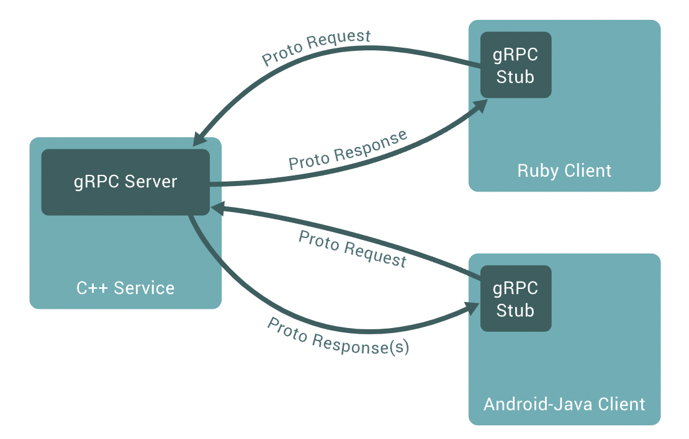

# gRPC

- [gRPC 공식 문서](https://grpc.io/docs/what-is-grpc/introduction/)

## Overview

- gRPC에서는 클라이언트가 서버 애플리케이션의 함수를 마치 local object인 것처럼 호출할 수 있다.  
  이로써 분포된 애플리케이션과 서비스를 쉽게 구축할 수 있다. 다른 RPC 시스템과 마찬가지로 gRPC도  
  서비스를 정의하고, 파라미터와 반환값과 함께 원격으로 호출할 수 있는 메소드를 기반으로 만들어졌다.  
  서버는 이러한 인터페이스를 구현하고 클라이언트의 요청을 처리하기 위해 gRPC 서버를 사용한다.  
  클라이언트 측에서는 stub를 사용해 서버와 동일한 메소드를 제공한다.



- gRPC 클라이언트와 서버는 다양한 환경에서 서로 소통할 수 있다.  
  물론 gRPC가 지원하는 언어를 사용해야 한다. 예를 들어, Java로 작성된 gRPC를 Go로 작성된 클라이언트와  
  소통하게 할 수 있다.

## Wroking with Protocol Buffers

- 기본적으로 gRPC는 Protocol Buffer를 사용한다. 이는 Google에서 만든 구조화된 데이터를 직렬화하는  
  메커니즘을 가진 오픈 소스이다. 간단히 어떻게 작동하는지 보자.

- 우선 처음에는 `*.proto` 파일에 직렬화하고 싶은 데이터 구조를 정의해야 한다.  
  Protocol Buffer의 데이터는 _message_ 들로 구조화되며, 각 메시지는 name-value의 쌍을 가지는  
  _field_ 들을 가지는 논리적 단위이다.

```proto
message Person {
    string name = 1;
    int32 id = 2;
    bool has_ponycopter = 3;
}
```

- 데이터 구조를 정의한 후에는 Protocol Buffer의 컴파일러인 `protoc`를 사용해 원하는 프로그래밍 언어에서  
  해당 데이터구조를 사용할 수 있도록 컴파일해야 한다. 컴파일 후에는 각 field에 접근하기 위해 `name()`,  
  `set_name()`과 같은 메소드와 함께 전체 데이터를 raw bytes로 직렬화/역직렬화하기 위한 메소드도 제공된다.  
  예를 들어 C++을 사용한다면, 위 proto 파일을 컴파일하면 `Person`이라는 클래스가 생긴다.  
  이후에는 이 클래스를 애플리케이션에서 자유롭게 생성하고, Protocol Buffer 데이터로 직렬화하고,  
  `Person`을 담은 Protocl Buffer Message를 역직렬화하기 위해 사용할 수 있다.

```proto
// The greeter service definition.
service Greeter {
	// Sends a greeting
	rpc SayHello (HelloRequest) returns (HelloReply) {}
}

// The request message containing the user's name.
message HelloRequest {
	string name = 1;
}

// The response message containing the greetings
message HelloReply {
	string message = 1;
}
```

---

# Core concepts, architecture and lifecycle of gRPC application

## Overview

### Service Definition

- 위에서 잠깐 봤던 서비스 정의 파일을 다시 보자.

```proto
service HelloService {
	rpc SayHello (HelloRequest) returns (HelloResponse);
}

message HelloRequest {
	string greeting = 1;
}

message HelloResponse {
	string reply = 1;
}
```

- gRPC에서는 아래의 4가지 서비스 메소드를 정의할 수 있다.

  - Unary RPC(단방향 RPC): 클라이언트가 단일 요청을 서버에게 보내고, 단일 응답을 받는 일반적인 함수 호출과 같은 형태

  ```proto
  rpc SayHello(HelloRequest) returns (HelloResponse);
  ```

  - Server Streaming RPC: 클라이언트가 서버에게 요청을 보내면, 서버가 일련의 message들을 반환하기 위한 stream을  
    만들어 주는 형태. 클라이언트는 반환된 stream으로부터 더 이상 message가 없을 때까지 읽는다.  
    gRPC는 내부적으로 stream 내의 message 순서가 지켜짐을 보장한다.

  ```proto
  rpc LotsOfReplies(HelloRequest) returns (stream HelloResponse);
  ```

  - Client Streaming RPC: Server Streaming RPC와 반대로 클라이언트가 서버에게 stream을 통해 일련의  
    message들을 전송하는 형태. 클라이언트는 모든 message를 write하면, 서버가 모두 읽고 나서 주는 반환을 기다린다.  
    마찬가지로 stream내의 message 순서가 지켜짐이 보장된다.

  ```proto
  rpc LotsOfGreetings(stream HelloRequest) returns (HelloResponse);
  ```

  - Bidirectional Streaming RPC: 클라이언트, 서버 모두 read-write stream을 사용해 서로에게 일련의  
    message들을 전송한다. 2개의 stream(클라이언트 -> 서버, 서버 -> 클라이언트)는 서로 독립적으로 작동하기에  
    클라이언트와 서버는 read, write를 각자가 원하는 대로 할 수 있다. 예를 들어, 서버갸 응답을 보내기 전에 클라이언트가  
    보낸 모든 message들을 수신하도록 할 수도 있고, 하나의 message를 읽고 하나의 response를 보내는 식으로도 할 수 있다.

  ```proto
  rpc BidiHello(stream HelloRequest) returns (stream HelloResponse);
  ```

### Using the API

- 서비스가 정의된 `*.proto` 파일로부터 시작해 gRPC는 클라이언트와 서버측 코드를 만드는 데 사용하는 `protoc`를 위한  
  다양한 플러그인들을 제공한다. 일반적으로 API를 클라이언트에서 호출하고, 해당 API에 알맞은 구현을 서버에 하게 된다.

- 서버 측에서는 서비스에 정의된 메소드를 구현하고, 클라이언트의 요청을 처리하기 위해 gRPC 서버를 실행시킨다.  
  gRPC 인프라스트럭쳐가 들어오는 요청을 decoding하며 알맞은 서비스 메소드 구현체를 실행시키고, 해당 서비스의  
  반환값(response)을 encoding한다.

- 클라이언트 측에는 _stub_ 라 불리는 local object가 있다. Stub은 쉽게 말해 서비스에 정의된 메소드를 클라이언트 측에서  
  구현한 것이라 할 수 있다. 클라이언트는 이후 서비스 메소드를 local object에 대해 호출하게 되는데, 파라미터 등 호출에  
  필요한 정보들을 알맞은 Protocol Buffer message 타입으로 생성한다. 이후 gRPC가 서버에게 요청을 보내고, 서버의  
  Protocol Buffer response를 받아오게 된다.

### Synchronous vs Asynchronous

- gRPC도 REST등 다른 RPC와 마찬가지로 응답이 올 때까지 스레드를 block하는 Synchronous 방식으로 처리가 가능하며,  
  thread를 block하지 않고 처리하는 Asynchronous 방식으로도 처리 가능하다.

## RPC Lifecycle

### Unary RPC

- 이전에 봤듯이, Unary RPC는 클라이언트가 서버에게 단일 요청을 보내고, 단일 응답을 받는 호출 방식이다.  
  과정을 보자.

- (1) 클라이언트가 stub method를 호출하면, 서버 측에서는 클라이언트가 호출한 metadata, 메소드명, deadline(optional)와  
  함께 클라이트에서 RPC를 호출했음을 알게 된다.

- (2) 알림이 온 서버는 응답을 보내기 전에 서버의 초기 metadata를 먼저 보낼 수도 있고, 아니면 클라이언트의 request message가  
  오기를 대기할 수 있다. 어떤 방식을 선택할지는 애플리케이션에 따라 다르다.

- (3) 서버에게 클라이언트로부터 request message가 오면, 적절한 처리를 해 response를 만들어낸다.  
  response가 만들어지면 클라이언트에게 status details(status code, optional status message), 그리고  
  metadata(optional)와 함께 전달된다.

- (4) response의 status가 OK라면 클라이언트는 response를 받게 되며, 클라이언트 측에서 호출을 마무리 짓게 된다.

### Server Streaming RPC

- Server Streaming RPC는 서버가 클라이언트에게 message들을 담은 stream을 반환한다는 것을 제외하면  
  Unary RPC와 동일하다. 모든 message를 전달한 후에 서버의 상태 정보(status code, optional status message)와  
  함께 optional metadata가 클라이언트에게 전달된다. 그리고 이 RPC는 서버 측에서 호출을 마무리 짓게 된다.  
  클라이언트는 서버의 message들을 모두 받은 것을 확인하면 호출이 끝났다고 판단한다.

### Client Streaming RPC

- Client Streaming RPC는 Server Streaming RPC와 반대로 클라이언트가 message들을 담은 stream을 서버에게  
  보내게 된다. 서버는 단일 response(+status details, optional data)를 보내게 된다. 하지만 서버가 클라이언트의  
  모든 message를 받았다고 판단하면, 굳이 response를 보낼 필요는 없다.

### Bidirectional Streaming RPC

- Bidirectional Streaming RPC는 클라이언트가 method를 호출하고, 서버가 클라이언트의 metdata, method name,  
  그리고 deadline을 수신하면서 시작된다. 서버는 이후 자신의 initial metadata를 먼저 보낼지, 아니면 클라이언트가  
  message들을 보내길 기다릴지 선택할 수 있다.

- 클라이언트측, 그리고 서버측의 stream 처리 방식은 애플리케이션마다 다르다. 이 두 stream은 서로 독립적이기 때문에  
  클라이언트와 서버는 message를 자신이 원하는 방식으로 read, write할 수 있다. 예를 들어 , 서버는 어떤 경우에는  
  클라이언트의 모든 message들을 다 받을 때까지 대기할 수도 있고, 아니면 클라이언트와 ping-pong 방식으로  
  소통할 수도 있다.

### Deadlines, Timeouts

- Deadline은 클라이언트가 RPC가 완료될 최대 시간을 정한 것이다. 만약 이 시간을 초과한다면 `DEADLINE_EXCEEDED`  
  에러와 함께 RPC가 종료된다. 서버 측에서는 특정 RPC가 시간초과(timed out)되었는지 질의할 수 있고, RPC가  
  끝나기까지 시간이 얼마나 남았는지도 질의할 수 있다.

- Deadline 또는 Timeout을 명시하는 것은 gRPC를 작성하는 프로그래밍 언어에 따라 다르다. 어떤 언어들은 Deadline의  
  개념을 사용하고, 또 어떤 언어들은 Timeout의 개념을 사용한다.

### RPC Termination

- gRPC에서는 클라이언트와 서버 모두 각각 호출의 성공 여부를 local에서 판단하기에 결과가 일치하지 않을 수도 있다.  
  예를 들어, 서버에서는 정상적으로 처리되었다고 판단된 RPC가 클라이언트에서는 Deadline 이후에 response가 왔기에  
  실패했다고 처리될 수 있다. 또한 클라이언트가 모든 request를 다 전달하기 전에 서버 측에서 RPC를 종료시킬 수도 있다.

### Cancelling an RPC

- 클라이언트나 서버 모두 RPC를 언제든지 취소할 수 있다. Cancellation은 RPC를 즉각적으로 종료시키기에  
  추후 작업도 실행되지 않는다.

- 한 가지 주의할 점은, Cancellation 후의 작업들은 rollback되지 않는다는 것이다.

### Metadata

- Metadata는 특정 RPC 호출에 대한 정보(ex. 인증 정보)이다. Metadata는 key-value 쌍의 형식을 가지며  
  key는 string, value는 string 또는 2진 데이터일 수 있다.

- Metadata에 대해 접근하는 방식은 프로그래밍 언어에 따라 다르다.

### Channels

- gRPC Channel은 gRPC 서버의 특정 host, port에 대한 connection을 지원한다.  
  Channel은 주로 클라이언트 stub을 만들 때 사용한다. 클라이언트는 channel의 속성을 직접 지정해 gRPC의  
  기본 동작을 변경할 수 있다.(ex. message 압축 해제 등)
