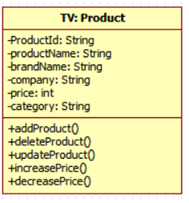

<h1>캡슐화</h1>

<h2>캡슐화의 개념</h2>

<h3>캡슐화의 정의</h3>

* `캡슐화는 관련된 데이터와 함수를 묶는 장치이다.`

* 캡슐화란 관련된 데이터와 관련된 함수들을 클래스라는 하나의 캡슐 속으로 그룹화 혹은 묶어주는 장치 또는 메커니즘이다.   
  따라서 캡슐화를 다른 말로 표현할 때 Bundling이라고도 한다. 이처럼 캡슐화 메커니즘이 관련된 데이터와 함수를 하나의 장치 속으로   
  묶어주기 때문에 어떤 개념을 추상화시켜 표현하는데 있어서 큰 도움이 된다. 결국 추상화가 잘되면 잘 될수록 프로그램의 모듈화를   
  향상시키는 결과를 초래하게 된다.

* 물론 이 캡슐화 장치는 객체지향 언어에만 존재하는 것은 아니다. 기존의 절차지향 언어에서도 이러한 캡슐화를 위한 시도로 C언어 에서는   
  `구조체(Struct)`나 `공용체(Union)`를 통해 사용되기는 하였다. 그러나 이 장치들은 관련된 데이터들을 묶어주는 장치에 불과했다.   
  이로 인해 특정 함수와 관련된 데이터들을 추적한다는 것이 매우 어려웠다. 이는 결국 소프트웨어 유지보수의 비용에 대한 부담을 가져왔다.   
  객체지향 언어가 새롭게 등장하면서 이러한 캡슐화가 완벽하게 지원되었다. 즉, 관련된 데이터와 함수들을 클래스라는 캡슐 속으로   
  묶어주는 장치가 등장하게 된 것이다.

* 캡슐화는 결국 클래스 혹은 객체라는 단위를 생성하는데 있어서 필수적인 요소이다. 따라서 정의된 클래스나 클래스로부터 생성된 객체 속에   
  서로 관련된 데이터나 함수들이 묶여있지 않으면 이는 캡슐화가 제대로 반영되지 않은 것이라고 볼 수 있다.

* 캡슐 속에 있는 데이터와 함수들은 매우 밀접한 관련성을 가져야 한다. 각각의 함수들은 같은 캡슐 내에 있는 데이터들을 접근하여 처리하는   
  기능들을 구현하고 있다. 이를 관련 있는 데이터와 함수들의 집합이라 한다. 여기서 말하는 관련성은 소프트웨어 공학적인 용어로 결합도가   
  높은 데이터와 함수들의 집합이라고 말한다. 한 캡슐, 즉 한 클래스 내에 있는 데이터와 함수들은 매우 결합도가 높은 데이터와 함수들로   
  구성이 되어야만 한다. 따라서 클래스 정의에 대한 적정성을 판단하는 기준 가운데 하나가 캡슐화가 잘 되어있는지를 파악하는 것이다.

<h3>캡슐화의 특성</h3>

* 캡슐화는 객체지향 프로그램을 개발 또는 관리하는 사람들의 입장에서 매우 편리한 장치이다. 다음은 캡슐화의 특성들이다.

* `1. 추상화의 단위가 된다.`
  * 추상화란 복잡한 문제를 다루기 위해서 불필요한 부분들은 숨기고 중요한 부분만을 표현하는 것을 의미한다.   
    이런 의미에서 볼 때 캡슐화를 하면 추상화가 된다고 볼 수 있다. 캡슐화는 관련된 데이터와 함수들을 하나의 캡슐 단위로   
    묶어주기 때문에 복잡한 내용들은 캡슐 내부 속으로 모두 숨어버리게 되고 외부에는 캡슐 단위의 의미 있는 단위로만   
    보여주기 때문에 추상화의 단위가 된다.

* `2. 재사용의 단위가 된다.`
  * 객체지향에서 캡슐화의 단위는 클래스 단위로 정의되고, 클래스를 통해 객체 단위로 생성되어 움직인다.   
    따라서 객체지향 프로그램에서의 재사용의 단위는 클래스 혹은 객체 단위로 사용되기 때문에 데이터나 함수 단위로   
    재사용하는 것에 비해 훨씬 재사용성이 높아지게 된다.

* `3. 정보은닉을 실현하는 장치이다.`
  * 캡슐화를 통해 인터페이스를 제외한 데이터와 함수들을 캡슐 속으로 숨기기 때문에 캡슐화를 통해 정보은닉이 실현된다.

<h3>캡슐화와 정보은닉</h3>

* `1. 캡슐화는 관련된 요소들을 묶음으로써 캡슐 내부와 외부를 구별 짓는 장치이다.`
  * 캡슐화를 하게 되면 관련된 데이터와 함수들이 캡슐 속으로 묶이게 됨으로써, 캡슐 내에 속한 부분과 캡슐 밖에 있는   
    부분들에 대한 명확한 구분이 이루어진다. 즉, 특정 객체 속에 있는 데이터와 함수들이 다른 객체 속에 있는 데이터와   
    함수들과 구별이 이루어진다. 이렇게 됨으로써 객체들 간에 서로 상대방 객체의 인터페이스(공용 함수)만을 볼 수 있다.   
    각 객체가 가지고 있는 데이터들은 해당 객체 속에 숨어있기 때문에 외부 객체에서는 볼 수 없다.

* `2. 정보은닉은 캡슐 내의 요소들에 대한 세부 구현사항을 외부에 숨기는 장치이다.`
  * 정보은닉은 캡슐화되어 있는 데이터와 함수들에 대해서 외부에서 해당 함수가 어떻게 구현되어 있는지에 대한 세부 사항을   
    숨기는 것이다. 따라서 캡슐화가 되어 있다고 해서 반드시 정보은닉이 되는 것은 아니다.

<h2>UML에서의 캡슐화</h2>

* 캡슐화 표기는 클래스 설계 시 묵시적으로 반영되어 설계된다. 아래 그림과 같이 `Product`클래스는 `Product`의 정보와 기능을   
  대변할 수 있는 추상화 단위이며 재사용 단위가 된다. `Product`클래스에 포함된 데이터와 함수는 서로 결합도가 높으며   
  데이터나 함수의 변경은 서로 영향을 줄 수 있다. 캡슐화의 정보은닉 특성은 접근 제한자를 통해 설계 가능하며, 아래 그림에서는   
  데이터에 대한 접근 제한자를 `-`(private)로 표기하여 외부에서 접근하지 못하도록 설계했으며, 함수에 대해서는 `+`(public)   
  으로 정의하여 외부에서 접근할 수 있도록 설계했다. 데이터뿐만 아니라 함수도 외부에 숨길 수 있다.

