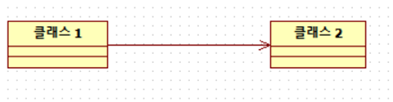
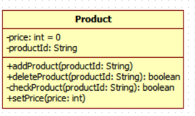
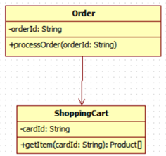

<h1>클래스</h1>

<h2>클래스의 개념과 특성</h2>

<h3>클래스의 개념</h3>

* 클래스에 대한 개념은 바라보는 시각에 따라 다양하게 표현이 가능하다. 즉, 분석 및 설계 입장에서는 추상적 개념으로 표현할 수 있고, 개발자의   
  입장에서는 구체적인 구현 관점으로 표현할 수도 있다. 이런 클래스를 객체지향 개념 관점으로 표현하면 다음과 같다.
  * `클래스는 명세 장치이다.`

* 일반적으로 여러 사물들은 타입을 지니고 있으며, 동일 타입으로 생성된 여러 사물들이 존재한다. 예를 들어, 쇼핑몰의 회원은 아이디, 비밀번호, 닉네임,   
  이름, 생년월일 등과 같은 속성을 갖는다. 이는 하나의 회원 클래스가 되며, 각각의 고객이 회원 가입을 함으로써 개별 회원 객체가 생성된다. 이러한   
  의미에서 클래스는 객체들에 대한 명세 장치 또는 도구라고 볼 수 있다.

<h3>클래스의 특성</h3>

* 객체지향 개념에서의 클래스는 아래의 특성들을 가진다.

  1. 클래스는 고유한 이름을 가진다.
    * 객체의 일반적인 특성 중 하나가 각 객체는 다른 객체와의 구별을 위한 유일한 식별자를 갖는다는 것이다. 이와 마찬가지로 특정 도메인에서 클래스가   
      중복될 수 없기 때문에 클래스도 다른 클래스와 구별되기 위한 고유의 이름을 갖는다. 따라서 특정 도메인에서 클래스를 추출하여 표현할 때에는 이름이   
      중복되거나 이름은 다른데 의미가 동일한 클래스가 존재해서는 안된다.

  2. 클래스는 속성을 지닌다.
    * 클래스는 의미 있는 정보의 저장소 역할을 하기 위해 속성을 내포한다. 이 속성(Property or Attribute)은 Java언어와 같은 구현 관점에서는 상태 변수,   
      멤버 변수 혹은 멤버 데이터 등으로 표현한다. 이는 객체의 특성 중 하나인 `객체는 상태를 갖는다.`와 연관된다. 즉, 특정 객체의 모태인 클래스에   
      필요한 속성이 없다면, 그 클래스로부터 생성된 객체도 상태를 갖지 못한다. 물론 클래스는 상태(값)를 갖지는 않고 다만 속성 선언만 할 뿐이다.   
      상태는 개별 객체들이 가지게 된다.

  3. 클래스는 잘 정의된 행위를 지닌다.
    * 행위를 구현 관점에서 표현하면 메소드, 즉 멤버 함수라 할 수 있다. 여기서 잘 정의된 행위란 클래스가 내포하고 있는 속성들을 사용하여 처리하는   
      기능을 말한다.

<h3>클래스와 객체</h3>

* 객체지향 개념에서 클래스와 객체의 관계는 아래와 같다.

  1. 클래스는 틀이고 객체는 실사례이다.
    * 일부 서적에서는 클래스 대신 객체 타입(Object Type)이라는 용어를, 객체 대신 인스턴스(Instance)라는 용어를 사용한다. 정의에서 기술한 것 처럼   
      클래스는 객체들의 공통된 속성과 행위를 기술하는 명세 장치, 즉 틀에 해당하기 때문에 오브젝트 타입이라는 용어로도 표현 가능하다. 그리고 객체는   
      오브젝트 타입이라는 틀에서 찍혀 나온 실제 사물이기 때문에 인스턴스 혹은 실사례라는 표현을 쓰기도 한다.

  2. 클래스는 상태를 갖지 않지만, 객체는 상태를 갖는다.
    * 클래스와 객체 모두 내부적으로 속성을 포함하고 있다. 그러나 클래스는 속성에 대한 선언만 내포하고 있는 반면에 객체는 선언된 각 속성들에 대해   
      값을 지닌다. 이러한 값을 객체의 상태라고 표현한다. 프로그래밍 관점에서 표현하면 클래스는 멤버 변수에 대한 선언만 하지만, 객체는 각 멤버 변수들에   
      대한 값을 지닌다는 의미이다.

  3. 클래스와 객체는 동일한 속성 및 메소드 개수를 가진다.
    * 한 클래스로부터 생성되는 객체들의 속성이나 메소드 수는 당연히 동일하다.
<hr/>

<h2>UML에서의 클래스 모델링</h2>

<h3>클래스 표기법</h3>

* UML을 이용한 클래스 표기는 클래스의 특성을 반영하여 정의할 수 있으며, 클래스 특성을 반영하기 위해 3행으로 구성된 Box로 표기한다.

* 클래스 표기는 클래스 다이어그램의 핵심 구성 요소로서 클래스명, 속성, 행위(함수)로 구성된다.

* 클래스의 속성은 `가시성(Visibility)` --> `속성명` --> `데이터 타입` 순으로 표기되며, 초기값은 선택정적으로 지정할 수 있다.

* 가시성은 객체지향 개념의 정보은닉을 설계하기 위한 도구로서 정보나 행위의 공개 여부를 결정할 수 있다. 가시성의 종류는 아래와 같다.
  * `Public` : 해당 클래스의 모든 정보를 공개한다. UML에서는 `+`로 표기한다.
  * `Private` : 해당 클래스의 정보를 외부에 공개하지 않고 내부에서만 사용하도록 한다. UML에서는 `-`로 표기한다.
  * `Protected` : 상속받은 서브 클래스에게만 정보를 공개하고 외부에는 공개하지 않는다. UML에서는 `#`로 표기한다.

* 속성명은 클래스의 필수 항목으로서 한 크래스 내에서 유일한 속성명을 가져야 한다.

* 데이터 타입은 기본 데이터 타입(Primitive Data Type)이나 객체 타입으로 정의될 수 있다. 기본 데이터 타입은 개발 프로그래밍 언어의 특성에 알맞게   
  정의될 수 있으며 객체 타입은 다른 클래스를 타입으로 정의하여 복합객체를 설계할 수 있다. 속성의 사용은 행위의 알고리즘에 영향을 줄 수 있으므로   
  신중하게 결정해야 한다.

* 클래스의 행위는 `가시성` --> `행위명(매개 변수)` --> `: 데이터 타입` 순으로 표기한다.
  * 행위 가시성은 클래스 속성의 가시성과 그 정의가 같고, 그 외에 `Friendly`는 `~`로 표기한다.
  * 행위명은 동사 형태로 정의하여 기능에 대한 명확성을 줄 수 있도록 한다. 오버로딩도 표기한다.
  * 행위의 매개변수 표기는 매개 변수명과 데이터 타입의 구성으로 표기된다.
  * 데이터 타입은 반환값에 대한 데이터 타입을 나타낸다. 행위, 즉 함수가 처리된 후에 처리 결과를 반환할 경우 반환값에 대한 데이터 타입을 표기하고   
    반환값이 없는 경우에는 데이터 타입을 표기하지 않는다.

<h3>클래스들 간의 관계 표기법</h3>

* 클래스는 독립된 단일 기능을 제공하며 이런 클래스들은 관계 형성을 통해 시스템에서 요구하는 기능을 제공할 수 있다. UML 클래스 다이어그램의   
  `연관(Association)`, `포함(Aggregation, Composition)`, `상속(Inheritance)` 관계 표기를 이용하여 클래스간의 관계를 설계할 수 있다.

* `연관 관계(Association)`는 클래스들 간에 요구하는 행위를 사용하는 관계를 의미한다. 예를 들어, `클래스 1`이 `클래스 2`의 특정 행위를 사용하는 경우   
  `클래스 1`과 `클래스 2`는 연관 관계를 가진다고 표현할 수 있다. 연관 관계는 아래와 같이 실선으로 표기하며, 연관명과 다중성으로 구성된다. 클래스들 간에   
  연관 관계를 화살표로 표현하며, `클래스 1`이 `클래스 2`의 행위를 사용할 경우 `클래스 1`에서 `클래스 2`로의 화살표를 표기한다. 아래의 그림에 표현된   
  연관 관계는 단방향성을 갖는 연관 관계라고 한다.



<hr/>

<h2>Java 클래스 구현</h2>

<h3>클래스 구현</h3>

* Java의 클래스 코드는 가시성, class 예약어, 클래스명, 중괄호로 선언하며 중괄호 사이에 속성 및 행위(메소드)를 구현한다. Java의 속성 및 메소드 선언은   
  UML과는 조금 다르다. 아래는 예시이다.



* 위 UML 다이어그램을 Java 코드로 나타내면 아래와 같다.

```java
public class Product {

    private int price;
    private String productId;

    public void addProduct(String productId) {
        //..
    }

    public boolean deleteProduct(String productId) { 
        //..
    }

    private boolean checkProduct(String productId) {
        //..
    }

    public void setPrice(int price) {
        //..
    }
}
```

<h3>클래스들 간의 관계 구현</h3>

* Java에서 클래스들 간의 연관 관계는 함수 호출 형태로 구현된다. 호출하는 클래스의 특정 행위에서 연관관계를 갖는 다른 클래스의 특정 행위를 호출하는   
  경우를 의미한다.

* 아래의 UML을 보자.



* 위 UML을 Java 코드로 구현하면 아래와 같다.
```java
public class Order {
    private String orderId;

    public void processOrder(String orderId) {
        ShoppingCart cart = new ShoppingCart();
        Product[] products = cart.getItem(orderId);
        //..
    }
}

public class ShoppingCart {
    private String cartId;
    
    public Product[] getItem(String cartId) {
        //..
    }
}
```

* `Order#processOrder()`에서는 `ShoppingCart#getItem()`을 호출하여 두 클래스 간의 연관관계를 구현한다. `ShoppingCart`클래스는 `Order`클래스의   
  속성 데이터로 객체를 생성하지 않고, `Order#processOrder()` 내에 함수의 변수로 정의하고 있다.

* 만약 아래 코드와 같이 `Order`가 `ShoppingCart`를 내부 변수로 가지고 있다면 이는 포함 관계(Composition)가 된다.
<hr/>